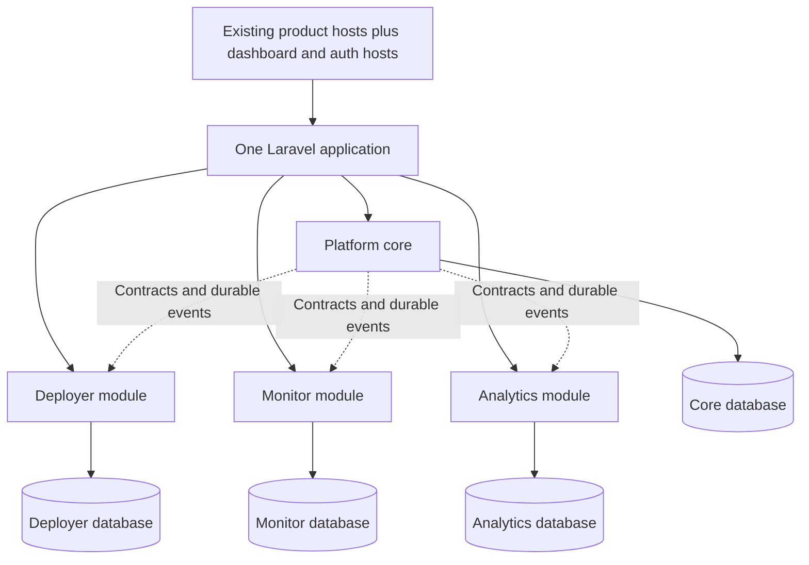

# Unified Buildpusher application plan

Prepared 23 September 2026; updated 25 September 2026. Implementation is in progress in `lessbuild/app` on `feature/unified-platform`, based on the current `origin/main`. The [draft pull request](https://github.com/lessbuild/app/pull/1) is open for review. The active release is source commit `2709156`; its local release pointer and live route checks are recorded in [the latest 25 September production verification](verification/unified-production-deployment-2026-09-25-2709156.md). The prior account-export release is recorded in [its 25 September production verification](verification/unified-production-deployment-2026-09-25-7694bdd.md); the earlier module-dispatcher release is recorded in [its verification](verification/unified-production-deployment-2026-09-25-25300c1.md), and the earlier shared-auth release in [its verification](verification/unified-production-deployment-2026-09-25-92afd2b.md). The earlier Signal source audit and theme release are recorded in [the release progress log](verification/signal-theme-integration-progress.md). A read-only account check found exactly one matching account with verified email in each of the four production databases. Its Deployer and Analytics identity maps are reconciled; its Monitor identity map remains held for review because matching email alone does not prove source-account ownership. Production runtime configuration selects Core authentication authority for all three enabled product hosts; this remains an environment override, not proof of migration readiness. The Core workspace-membership audit and product-access projection-metadata migrations are applied. The Core database backup taken before the latter is `/var/backups/buildpusher-unified/release-migrations/core-before-6df1783.sqlite`. On 24 September, preserved product data and eligible identity, resource, and plan mappings were imported into the four separate production SQLite databases after verified private backups; unresolved account and billing ownership remains held for review. The live migration counts and checks are recorded in section 10. The current production route smoke and Analytics scheduler handoff are recorded in [the cutover verification](verification/unified-production-cutover-2026-09-24.md).

## Implementation status

Core account security is live with a Signal page for password changes, TOTP enrollment/confirmation/cancellation, recovery-code regeneration, passkey sign-in and management, and browser-session review/revocation. Passkey credentials and counters stay in Core, the login ceremony preserves the platform's second-factor challenge, and the security page renders safe passkey metadata without credential material. Password changes retain the active session, revoke other Core auth sessions, and rotate the shared remember token; product-host links use the existing SSO handoff. Tests have been authored but remain deferred until the full plan is complete. Core account data now has an authenticated, private JSON export for identity, workspace/project access, personal dashboard settings, product grants, owned-workspace plan summaries, feedback, and security metadata; secrets and product operational records remain excluded. Analytics now adds an owner/admin-only streamed export of workspace membership, site configuration and retained history, goals and versions, ingestion batches, events, visits, conversions, report aggregates, usage periods, and report-export metadata; verification/download tokens and private file/error details are excluded, and pseudonymous visitor/session IDs are disclosed. Its regression coverage is authored and deferred. Under Core authentication authority, Deployer's local account/workspace DELETE routes now return `409` and the UI explains that coordinated cleanup is still unavailable; legacy authority retains its prior behavior. This guard prevents partial local deletion but does not complete the required cross-product lifecycle workflow. Deployer now also provides owner/admin-only streaming NDJSON exports per active workspace, covering membership, projects/environments, secret-free variable metadata, provider/infrastructure metadata, website/domain/health records, repository/build/preview history, schedules, status pages/incidents, and backup/alert metadata. Secrets, values, commands, logs, payloads, and endpoint credentials remain excluded; the existing personal account export is unchanged. Full product-data portability, coordinated account/workspace deletion, and cross-host security acceptance remain open pending review of remaining operational and billing records and migrated-customer rehearsal. See [Core account data export progress](verification/platform-account-data-export-progress-2026-09-25.md), [Analytics workspace data export progress](verification/analytics-workspace-data-export-progress-2026-09-25.md), and [Deployer workspace data export progress](verification/deployer-workspace-data-export-progress-2026-09-25.md).

Core now contains the shared GitHub, GitLab, and Bitbucket sign-in and account-linking flows. Login resolves the exact provider identity first; an email match only directs the person to sign in and connect deliberately, and an identity already owned by another account cannot be attached. New social accounts require a verified provider email and create a Core workspace unless a matching workspace invitation is pending. Account security shows linked identities and preserves another usable sign-in method when unlinking; current-password and authenticator checks protect link and unlink actions. Callback URLs are centralized on `auth.buildpusher.com`. The focused identity-resolution and ownership tests are authored and deferred with the rest of the suite. Production currently has no credentials for these three providers, so sign-in buttons remain hidden and connection controls report that setup is unavailable. Provider-console setup and real callback, MFA, invitation, and cross-host acceptance remain open; see [shared social authentication progress](verification/platform-social-auth-progress-2026-09-25.md).

Analytics collection now reads its 20-event and 32,768-byte request bounds from the same constants used by its OpenAPI contract. The published POST and CORS-preflight operations document their configured per-IP and per-site/IP limits, standard `429` headers, response codes, and JSON error bodies; Core Help displays the current limits and request bound. Deferred tests cover route/document parity, configured limits, rate-limit headers, and oversized payload rejection. See [Analytics API reference progress](verification/analytics-api-reference-progress-2026-09-25.md).

Signed-in users now save the shared Signal appearance (`system`, `light`, or `dark`) in their Core preferences from any configured app host. The server-rendered Core preference wins over stale per-host local storage, and the shared theme controller reports save state accessibly while retaining local-only behavior for guests. Deferred coverage includes preference validation and preservation, server rendering, authenticated updates, stale-storage precedence, and cross-host reuse. Broader theme gallery and screen acceptance remains open; see [shared theme preference progress](verification/signal-theme-preference-progress-2026-09-25.md).

The Deployer activity provider also reports non-active DNS and TLS states for websites with an unambiguous, currently authorized Core environment mapping. It presents the two status layers with freshness-aware pending/unknown states and links to the authorized Deployer website page; domain names, provider IDs, DNS record IDs, and error text are not selected or shown. Deferred coverage includes active, failed, expiring, manual-setup, stale, cross-organization, and healthy-domain states. This I8 projection reuses Deployer's status records and does not create another domain authority; broader task retry/cancellation and tenant/reload acceptance remain open. See [workspace activity progress](verification/workspace-activity-progress-2026-09-24.md).

The preview-first historical Deployer feedback importer and its remaining cutover gates are documented in [Deployer feedback import progress](verification/deployer-feedback-import-progress-2026-09-25.md).

Monitor deployment details compare Monitor's own release-tagged request counts, error-flagged requests, error-signal ratio, average timed duration, exception records, and distinct linked issues over equal same-service/environment windows. The Signal table shows request and timed-sample counts and defines the error calculation; it warns that telemetry sampling, retention, and traffic mix limit interpretation. Connected Analytics sites add pageviews, distinct visitors, goal conversions, and converted visits under Analytics' report-compatible event eligibility rules. Both products use the same UTC windows, capped by elapsed time and the workspace plans; accepted, processed, pending, and failed batch intake is shown separately from event-time metrics. The Analytics comparison distinguishes no accepted data from zero recorded event activity and identifies the latest batch time as a site-wide activity timestamp, not a coverage watermark. It links to the authorized Analytics site, other same-service deployments, and incidents that overlap the exact environment/window. Tracker completeness, source-report reconciliation verification, and full acceptance remain open. See [release traffic comparison progress](verification/release-traffic-comparison-progress-2026-09-25.md).

Core now routes connected-project deliveries through a typed `ProjectConnectionDeliveryConsumer` contract. Monitor and Analytics register their own consumers with explicit event, capability, and target-product metadata; Core selects a registered consumer and the target module retains its authorization, idempotency, and local transaction. A tokenizer-based module-boundary check rejects direct product-to-product class references and explicit reads/writes against another product database, and runs in a dedicated GitHub Actions workflow. The delivery-registry regressions are authored but remain unrun. Deployer and Monitor own the source-outbox adapters for discovery, claims, retry, lease recovery, and repair scans. The delivery and reconciliation commands now resolve product-owned dispatch adapters through a Core registry instead of selecting concrete product dispatchers; Core retains the canonical connection and delivery policy. See [module contract progress](verification/module-contracts-progress-2026-09-25.md).

Core Help now includes Analytics' tracker and collection API alongside Deployer and Monitor references. Analytics serves its versioned OpenAPI 3.1 contract from the configured product host and documents the real batch limits, site-origin checks, asynchronous acceptance, retry identity, tracker consent opt-out, and public-ID boundary. The Monitor reference now explains the signed outbound alert-webhook protocol, at-least-once delivery, receiver acknowledgement, and bounded retries, with a shared-auth destination-manager link when Monitor's host routes are configured. Its generated inbound OpenAPI contract now documents request and response schemas, create-versus-replay statuses, the legacy `X-Beacon-Token` auth option, malformed/oversized/unsupported-body responses, and the same per-token/IP/monitor limits used by runtime middleware, including standard `429` retry headers. Core renders response codes and those limits beside each endpoint. Regression fixtures now cover Monitor route/documentation parity and rate-limit headers; they are authored but remain deferred until plan completion. Core also aggregates recent Deployer repository webhook events and Monitor signed alert-webhook deliveries on the workspace delivery-history page. The page requires active workspace, product, project, and source-resource access, caps each source at 100 rows, omits payloads and endpoint secrets, and links to source-app records for reauthorization and permitted retry. Analytics collection currently has no outbound webhook-delivery records. Central credential mutations, wider delivery coverage, and complete API compatibility acceptance remain open; see [Analytics API reference progress](verification/analytics-api-reference-progress-2026-09-25.md), [workspace delivery history progress](verification/workspace-delivery-history-progress-2026-09-25.md), and [Monitor API reference progress](verification/monitor-api-reference-progress-2026-09-25.md).

Deployer API tokens issued from Automation are now bound to the active Deployer workspace, with optional project allowlists. The API filters project/deployment collections and checks the token's workspace and project claims alongside the existing abilities, membership, project policies, and plan entitlements; promotion checks both the source and target project. Legacy tokens keep their prior behavior until revoked or rotated, and rotating a legacy token adds the active workspace scope. A Signal workspace credential inventory now summarizes the signed-in user's Deployer API tokens and authorized Monitor ingestion, queue, and heartbeat keys using explicit Core project/resource mappings. It omits secret/hash values and sends create, rotate, and revoke actions back to the product that owns each record; Analytics site IDs remain public identifiers, not credentials. Core's Deployer endpoint list now renders from the same versioned OpenAPI contract served by Deployer, including its configured product host, and provides a contract-derived version 2 configuration example with distinct preview, review, and explicit apply steps. Core Help now documents Deployer's per-repository GitHub, GitLab, and Bitbucket webhook signatures, GitHub App endpoint, delivery deduplication and response statuses directly from the handlers. Endpoint-by-endpoint compatibility fixtures, full callback coverage across products, broader retry controls, and real-client rehearsal remain open; see [workspace credential inventory progress](verification/workspace-credential-inventory-progress-2026-09-25.md), [Deployer API reference progress](verification/deployer-api-reference-progress-2026-09-25.md), and [Deployer API token scope progress](verification/deployer-api-token-scope-progress-2026-09-25.md).

Core now owns the shared Help center, Deployer guide/API pages, and Monitor's generated API reference; legacy documentation paths hand off to Core while each product's machine-readable OpenAPI endpoint stays on its configured app host. Core renders published Monitor customer status pages from a typed provider at `/status/monitor/{slug}` and Deployer pages from its provider at `/status/deployer/{slug}`; established Monitor and Deployer public URLs remain available. Core workspace administration manages Deployer page CRUD and incident/maintenance updates through Deployer's entitlement-checked actions and Monitor page CRUD through Monitor's guarded status-page service, while each source database owns its status records. The Core workspace administration index brings shared projects/team/plans/costs/feedback together with a route catalog for app features; each product continues to own its operational records and enforce its existing policies. Core provides encrypted workspace feedback with product-grant checks and owner/admin review, a Deployer cost breakdown through an authorized module provider, and the public platform status page. Platform status now aggregates Deployer diagnostics with bounded Monitor and Analytics readiness checks, independently degrading unavailable products; Monitor and Analytics now expose bounded database/cache and queued-worker liveness components through product-owned health endpoints; scheduled probe deployment and production freshness acceptance remain open. A single Signal workspace dropdown is shared by desktop topbar and mobile navigation. Regression tests for help/status routing, status management, feedback permissions/encryption, and responsive picker architecture are authored and intentionally unrun until plan completion. Final Deployer feedback cutover, fully centralized checkout/portal/webhook lifecycles, operational diagnostics beyond bounded database/cache/worker liveness, cross-host acceptance, and full admin feature/action acceptance remain open; see [shared surfaces progress](verification/core-support-admin-surfaces-progress-2026-09-25.md).

The Core Signal notification inbox groups authorized Deployer, Monitor, and Analytics activity by project and environment, with per-user read state and product/project/severity display preferences. Its visible unread count, shared-shell indicator, filtered rows, and bulk-read action now use one state/product/severity/project-filtered item set, so the count cannot include notifications hidden by the current inbox filters. Inbox preferences leave product email, alert destinations, and escalation behavior unchanged. Filtered-count and empty-state regressions are authored but remain unrun until plan completion; see [workspace notification progress](verification/workspace-notifications-progress-2026-09-25.md).

Core now has a dedicated Signal Plans page for each workspace. It presents Deployer, Monitor, and Analytics as separate plan slots; billing managers can review each app's current plan snapshot, status, period, active-seat count, and mapped Analytics monthly event usage, while other members see only their own app-access state. The workspace team access form previews the projected seat use for a new grant under that product's plan; existing-role changes explain the unchanged count and revocation impact. Deployer's module now normalizes recognized Stripe seat add-on quantities from subscription line items and shows them only to workspace owners and billing managers; unknown billing items remain explicitly unverified. This Deployer-specific quantity is separate from Core's app-access seat count. Monitor reports app access against its plan's included seat limit, and Analytics retains its separate no-charge legacy access slot because the source app has no paid billing catalog. Deployer and Monitor billing buttons hand off to their app billing routes using the shared-auth SSO flow. Monitor's Core-authority billing path now guards workspace checkout, uses its Stripe portal, projects verified webhook events into Monitor's independent Core subscription slot, and retries unresolved mappings from Stripe on a bounded schedule. Analytics site creation and event collection now check separate plan allowances in locked Analytics transactions; the imported no-charge legacy snapshot keeps both allowances unlimited. Finite event allowances count accepted events by UTC calendar month across mapped workspace sites, ignore duplicate retries, preserve usage when event detail is pruned, and reject an over-limit batch atomically; billing managers can review the current usage without exposing it to ordinary members. No Analytics price or paid catalog is inferred. Deployer still retains its owner-level source subscription while two organization slots await an explicit ownership decision; Analytics paid-plan terms, historic billing-identity reconciliation, and complete lifecycle acceptance remain open. Regression cases remain authored and intentionally unrun until the plan is complete; see [workspace subscriptions progress](verification/workspace-subscriptions-progress-2026-09-24.md), [Monitor billing projection progress](verification/monitor-billing-projection-progress-2026-09-25.md), [Analytics site limit progress](verification/analytics-site-plan-limits-progress-2026-09-25.md), and [Analytics event usage progress](verification/analytics-event-usage-progress-2026-09-25.md).

The user has confirmed that future product subscriptions belong to a workspace/team, with one independent subscription per app. The unresolved production record is only the destination workspace for the existing Deployer owner-level subscription. The importer now offers a read-only allocation preview and an explicit one-workspace import that records owner evidence and source billing identifiers; other organizations owned by that account receive separate no-charge slots. The exact destination still requires the workspace owner's choice, and no production allocation has been applied; see [Deployer workspace billing progress](verification/deployer-workspace-billing-progress-2026-09-25.md).

Core workspace search already combines project, Deployer server/deployment, Monitor incident, and Analytics site results through module-owned adapters. Monitor search now requires every linked incident source to be within the current Core workspace's explicitly mapped Monitor workspaces where the user remains a local member; a match on just one side cannot expose an incident linked to an inaccessible workspace. Deployer search now includes environment-only builds and rejects builds whose repository and environment resolve to different organizations, avoiding a result attributed to the wrong workspace. Regression cases cover both boundaries and remain unrun until plan completion. Search snippets contain no alert payloads or credentials. Full revoked-access, destination-action, keyboard, and partial-product-outage acceptance remains open.

Core account registration now creates a normalized Core identity and its first owned workspace in one Core transaction, applies the existing open-registration/first-account policy with a database mutex, and sends a signed verification link through the configured auth host. The first account receives no product grant or subscription. Core's Signal team page now supports owner/admin invitations, email-bound account registration or sign-in acceptance, and revocation using hashed, expiring single-use tokens. Invitation acceptance creates only shared workspace membership: it does not provision local product principals, product grants, or subscriptions. Workspace owners can now change non-owner roles and owners/admins can revoke eligible members through the Signal team page; revocation also removes Core product grants and project memberships and records an audit event. Workspace owners/admins can review the latest 30 role and membership changes on the team page. Module-owned local product-principal provisioning on first product access is implemented for reconciled identities. Invitation-source migration and complete role reconciliation remain open before cross-product onboarding is complete.

Verified Core users can now create additional canonical workspaces from a dedicated Signal workspace directory, with the owner membership written in the same Core transaction and no product access or subscription granted implicitly. The Core workspace dropdown links to this directory from the dashboard. Under Core authentication authority, Analytics no longer creates product-local workspaces when a canonical mapping is absent; it directs users to Core workspace management and fails closed on orphaned access. Its legacy-auth mode retains the existing product-local flow. Workspace creation and orphan-boundary regression tests are authored and remain unrun until the implementation plan is complete.

Workspace team management now also assigns Deployer, Monitor, and Analytics access independently, checks each product's active Core plan and seat cap, projects the least-privilege role into explicitly mapped app workspaces, and records product-grant changes in the audit history. Deployer and Analytics member roles map to their native Developer and Viewer capabilities; product admin grants are owner-managed, and imported product-owner grants cannot be demoted through the shared selector. Revoking a Core product grant blocks app access even if a legacy membership cannot be cleaned up; the page flags pending cleanup and lets workspace managers retry it manually. Deployer project links now carry an authorized organization context for that request and preserve the user's saved workspace selection. A five-minute scheduled retry now processes only explicitly tracked cleanup records, and leaves ambiguous identity mappings pending until they can be resolved. Complete source-role reconciliation and the full per-feature role matrix remain open. Commit `6df1783` passed 45 focused tests with 291 assertions before deployment; the new migration and live Core database integrity check passed.

The current implementation routes local workspace membership writes through a Core contract and registry, with distinct Deployer, Monitor, and Analytics projectors owned and registered by those modules. Core resolves the reconciled local principal and delegates; each module supplies its model, relation, database, and native role mapping. Shared mechanics preserve existing behavior for source owners, local role changes, grant updates, and cleanup. The architecture slice passed 44 focused tests with 279 assertions and Pint, with no schema changes.

First-login provisioning now follows its own typed contract and registry. Core retains ownership of canonical identity-map orchestration, while each product module owns local account creation/synchronization and product-specific setup. This preserves exact reconciled-ID handling, keeps email collisions held for explicit review, and leaves Deployer and Monitor workspace creation with their owning modules. The shared-auth regression slice passed 17 tests with 111 assertions, covering identity synchronization, collision rejection, and provisioned workspaces.

The current branch includes Core and peer product providers, four named database connections, optional exact-host configuration, and the Signal Topbar SaaS shell. Deployer's routes, controllers, requests, middleware, models, actions, jobs, notifications, commands, policies, services, scripts, product views, and 134 migrations now live under `app/Modules/Deployer`; its views keep their established names and resolve before the shared application view path. Monitor's pinned source has been imported under `app/Modules/Monitor`, including its full view set and 45 migrations. Analytics' pinned source has been imported under `app/Modules/Analytics`, including its tracker, ingestion/reporting workflows, and 22 migrations; its routes, views, database operations, queues, exports, workspace access, and policies have explicit module boundaries. The unified Composer lock now resolves Analytics' Fortify and Horizon dependencies, including the transitive `laravel/passkeys` package. Core's `PlatformUser` implements Fortify's two-factor/passkey contracts, Core registers its passkey model, and a normalized Core user provider, `platform` session guard, and Core password-reset token store are configured. Core-backed password login, imported TOTP/recovery-code challenges, password reset, safe return-target allowlisting, and Signal authentication screens are implemented. Configured hosts now exchange a Core login through a short-lived, hashed, single-use POST ticket bound to exact issuer and audience origins; host-only product sessions carry the same revocable Core auth-session ID, and password reset revokes active sessions. A Core product-principal registry resolves each module's source user only through exactly one reconciled identity map, exposes it request-locally under that module's guard, and fails closed for missing or ambiguous mappings. Product routes now select `legacy` or `core` authentication per module through `*_AUTH_AUTHORITY`; defaults remain legacy. Core-authenticated routes require an active platform session and exactly one reconciled local identity, then expose that product's local principal so its models and policies continue to apply. Deployer, Monitor, and Analytics workspace paths now also require the selected local organization/workspace to have an explicit reconciled Core workspace mapping, an active Core membership, and an active grant for that product; a revoked grant blocks direct access. Product subscription entitlement remains on each separate plan-authority switch while legacy billing ownership is reconciled. Product guest routes redirect to central login with an allowlisted return target, product logout ends the Core session, and Deployer organization checks run only on Deployer authenticated routes after principal resolution. `SESSION_DOMAIN` remains unset; configured hosts use the explicit SSO handoff rather than relying on a parent-domain cookie. Host-specific routes are mounted only for configured origins. A local HTTPS Chromium test now covers auth handoff, secure host-only cookies across all four hosts, and shared-session logout revocation; production authenticated smoke remains required before any cutover. This is opt-in integration groundwork, not cutover: reconciled accounts provision local product principals on first product access, while invitation acceptance still creates shared workspace membership only. Automatic acceptance-time product provisioning, product provider/social sign-in, full account-security parity, production authenticated smoke, and ambiguous identity ownership remain release gates; the local cross-host browser fixture is passing. Core invitation acceptance is implemented for shared workspace membership, while product access remains a separate grant. Analytics' legacy Fortify authentication provider remains inactive; its module routes can use the same authority switch once its host, identity, and queue configuration are enabled. Monitor and Analytics are disabled by default in code until their Core identity, project/workspace access, billing, and migration paths are fully integrated and verified; the current production environment overrides both to enabled with Core authentication, so this override must not be mistaken for completed migration readiness. Read-only-first Deployer, Monitor, and Analytics account importers now preview collisions and eligibility through `platform:import-deployer-identities`, `platform:import-monitor-identities`, and `platform:import-analytics-identities`; Deployer's workspace/project importer is available through `platform:import-deployer-workspaces-projects`; Analytics workspace, membership, invitation, and site-to-project mappings are available through `platform:import-analytics-workspaces-sites`, which requires reconciled account maps; Monitor workspaces, memberships, invitations, applications, and environments can be mapped through `platform:import-monitor-workspaces-applications` after identity reconciliation. Monitor's current workspace plan, Stripe customer/subscription identifiers, period and cancellation state, checkout session metadata, and idempotent webhook-event history can be imported with `platform:import-monitor-subscriptions`. It namespaces Stripe records under the Monitor provider account, keeps the current entitlement separate from historical canceled subscriptions, and does not copy stored checkout URLs. Deployer's owner subscriptions, Cashier subscription/item identifiers, payment summary, and effective current plan can now be imported with `platform:import-deployer-subscriptions` after identity and organization mappings; multi-organization owners are held for review rather than duplicating their shared Stripe subscription. The identity importers preserve password hashes and account verification without merging accounts by email; Deployer also maps social identities and re-encrypts supported MFA data, while Analytics also imports passkey records and re-encrypts supported MFA data. Unknown or invalid source encryption keys and identity conflicts are held for review. Each command defaults to a read-only preview and requires `--apply` to write. A later apply rechecks records previously held for review after source values or conflicts are corrected, retaining prior reason codes in mapping history; production import results and the unresolved account/billing ownership decisions are recorded in section 10. Core now has Signal-based workspace project directory, create, and detail screens with membership checks, per-product plan slots, product-grant-filtered resources/connections, and module-owned product-link adapters. A product link appears only when Core project/product grants and the product's own workspace or organization membership both permit it; Monitor links open the mapped application and Analytics links open the mapped site dashboard. Those destination routes derive their workspace from the explicit resource without overwriting another tab's workspace selection. Creating a Core project shares project membership with active workspace members but does not activate a product or start a subscription. The Signal project Connections panel now lets workspace owners/admins map active resources across supported product directions, checks project and product access at both ends, records pending mappings plus actor-stamped create/disconnect/reconnect history, and preserves the mapping after disconnect. Deployer success events now flow through a versioned outbox in the source transaction into durable Core deliveries for Monitor and Analytics. Monitor records an authorized deployment with a receipt in the same Monitor transaction; Analytics writes an idempotent site release annotation and displays it on the Analytics dashboard without adding it to visitor events. The worker rechecks connection state, mappings, product grants, and both plans; it stops on disconnect or revoked access, retries transient failures, and exposes delivery state plus owner/admin retry in the project UI. Monitor incident lifecycle annotations for opened, acknowledged, and resolved changes now flow to connected Analytics sites through a versioned Monitor outbox, durable Core deliveries, target authorization, and an idempotent Analytics timeline. Analytics-to-Monitor traffic context is now an active read-only connection that displays plan-bounded aggregate traffic in Monitor incident investigations; event-scoped reconciliation now provides a read-only preview and explicit apply for missing Core deliveries, while crash/outage rehearsal and broader production acceptance remain future work. The Core UI requires migrated/reconciled identities and workspace/project mappings; the default product account provider remains Deployer while the parallel Core `platform` guard is integrated. Shared Signal topbar, navigation, command-palette, UI primitive, and dialog components are in the application resource path and are composed by the product layouts. New shared UI uses `x-signal.*`; existing `x-ui` and `x-dialogs` names forward to the shared implementations while product pages migrate. The topbar follows Signal's two-row Topbar SaaS reference: brand/workspace/product navigation above contextual selectors and product-local navigation. A Core schema defines identities, workspaces, workspace/project access, canonical projects/environments, product/resource mappings, explicit connections, legacy identity maps, billing customers, separate product subscriptions, and durable product billing events. `platform:migrate {module}` runs only the selected module directory on its named connection. A typed Core plan resolver now validates each workspace/product subscription and immutable entitlement/limit snapshot. Deployer entitlement and quota services can use it through `DEPLOYER_PLAN_AUTHORITY=core`; the default remains `legacy`, and missing reconciliation or plan data fails closed without falling back to the legacy owner plan. Focused tests cover app isolation, immutable snapshot limits, status/expiry checks, malformed records, and fail-closed behavior. Monitor subscription imports now add normalized Core entitlements and limits, and an opt-in adapter enforces Monitor quotas, feature gates, event usage, and safe retention behavior. `MONITOR_PLAN_AUTHORITY` defaults to `legacy`; checkout/portal/webhook integration, customer-data rehearsal, and Analytics billing design remain open. Full product auth-flow and security integration, host context bridges, live workspace checkout/portal/webhook integration, Analytics subscription design, Monitor and Analytics authenticated host integration and full billing lifecycle integration, project provisioning workflows (Core project editing and reversible soft archive/restore are implemented for workspace owners/admins, preserving app mappings, subscriptions, resources, and connection history while recording actor-stamped lifecycle events), module feature regression, and the remaining Deployer legacy migration entry-point audit remains outstanding. The Analytics workspace/site, Monitor workspace/application/environment and subscription importers, and Deployer workspace/project and subscription importers have completed an initial private-copy rehearsal, but identity/resource reconciliation and full customer-data verification remain open. This work is in progress on the agreed feature branch and draft PR.

Core's project detail now includes per-product setup checklists whose completion follows existing Deployer, Monitor, and Analytics records. Where a canonical environment is explicitly mapped, Deployer repository/deployment and Monitor telemetry/health-check steps report independently for that environment; missing or stale source mappings remain actionable. Analytics verification and tracker-event steps are evaluated independently for every authorized site linked to the project, with each action opening that site's setup screen. Projects without explicit Deployer/Monitor environment mappings retain project-level setup guidance. Workspace owners/admins can link authorized existing module resources into a canonical project from the same page, even before that project's product module is active; the explicit link activates its Core module association but does not buy or alter a subscription. Product adapters filter candidates by mapped identity and source membership, and the Core mapping's unique resource key prevents duplicates. This remains an incomplete I1 implementation: imported-data reconciliation, full authorization/lifecycle acceptance, product provisioning, and rehearsal are still open. [Signal shell previews](previews/README.md) show the workspace and project layouts with representative data.

Core also now lets workspace owners/admins create canonical project environments and explicitly map authorized Deployer and Monitor app environments to one of them while linking existing resources. The project detail accepts a tab-local shared environment selection, validates it against the active project, scopes Deployer and Monitor summaries/setup to their explicitly mapped local environments, and opens an authorized environment destination when switching from the Core project view. App-switch links carry canonical `context_project` and `context_environment` query values while preserving destination filters and URL fragments. The Core selector only emits a direct app link for one available mapping. When a specific environment is selected, missing, stale, inaccessible, or ambiguous mappings return to the Core project/environment view instead of choosing a resource; without a selected environment, product-wide dashboard links remain available. Deployer, Monitor, and Analytics now validate incoming project/environment hints against the signed-in Core identity, active workspace/project membership, product grant, active canonical environment, and exactly mapped local resource before overriding cross-app topbar links. Invalid or stale hints show a Signal warning and do not alter app links. This validation is limited to cross-app navigation; action and queued-job scoping, coverage at every deep-link entry point, and cross-host browser tests remain open. Analytics reports that its data is site-scoped when a shared environment is selected. Missing, inactive, cross-project, or unmapped environments remain visibly unavailable; there is no Production fallback. This advances I9's first phase, while preference persistence, deep-link/action scoping across every entry point, queued-work context propagation, host-switch isolation, full imported environment reconciliation, staging-isolation acceptance, and customer-data rehearsal remain open.

Project delivery progress now groups Core delivery records by their source outbox event, showing an explicit successful Deployer/Monitor source step followed by each connected-app step with queued, attempted, and delivered timestamps plus a safe status. Workspace owners/admins can retry one failed or blocked delivery at a time. They can pause or resume a connection's automation without disconnecting resources or deleting history; paused queued work remains pending, and the worker rechecks current connection, grant, and plan authority before delivery. This is the first I2 UI/control slice; replay, crash/outage, concurrency, and full customer-data acceptance remain open. A workspace workflow activity page now retains up to 30 recent authorized connected-app runs across accessible projects, links back to each project, and offers owner/admin retry for a single failed step. Its Deployer-owned read-only provider now includes builds, measured provisioning progress, backup/restore verification, scheduled-task runs, mapped database inspection snapshots and clones, server-command state, pre-build configuration delivery, preview deployment and initialization state, and preview stack cleanup through current project/product grants, local membership, exact workspace mappings, and explicit project/environment resource mappings. Analytics CSV exports and event-processing batches now join workspace activity through an Analytics-owned provider; export records support authorized status, download, and manager retry while event summaries contain no batch payloads or failure content. The Deployer, Monitor, and Analytics task-provider regressions are written but deferred. Monitor activity includes telemetry receipts, scheduled checks, heartbeat runs, and alert-notification deliveries, and Analytics activity includes event processing and exports. The full I8 task-provider inventory, delivery/provider retry and cancellation coverage, and tenant/reload acceptance remain open.

**I8 progress update (2026-09-25):** Deployer's workspace activity provider also projects repository webhook deliveries that have not produced a canonical build. It only includes deliveries whose repository website resolves to one active Core project and the same Deployer organization, suppresses build-linked duplicates, bounds terminal history to 30 days, and links to the existing authorized repository screen. Delivery IDs, revisions, commit messages, changed paths, and webhook payloads are not selected or shown. Cross-project or cross-workspace ambiguity fails closed. Deployer also projects server diagnostic snapshots through active environment mappings, verifies the server's organization and every active Core project mapping for that server, treats expired diagnostic leases as unknown progress, and links to the existing authorized server screen. Diagnostic checks, errors, attempt tokens, and other diagnostic internals are not selected or shown. Website and server log refreshes now contribute allowlisted status/timestamp summaries through a shared Deployer resource-mapping service, with terminal history bounded to 30 days and result links back to the authorized resource pages. Log contents and refresh errors are not selected or shown; detailed log access and refresh controls stay in Deployer. Recent Deployer website-health check outcomes now appear through the same safe website mapping, bounded to 30 days and linked to the authorized health-check history; endpoint URLs, HTTP response details, and check errors are not selected or shown. Revision-bound post-deployment health observations now join the mapped build workflow, report lease-expired progress as unknown, and link back to the authorized build page; observation URLs, revisions, HTTP evidence, claim tokens, and error details are not selected or shown. Regression coverage for these additions is written but remains unrun until the full plan is complete.

Deployer's Core activity provider now includes current load-balancer configuration state through an explicit environment mapping, after confirming the balancer and its dedicated server belong to the same source organization as the mapped Deployer project. It shows pending and failed work plus successful applications from the last 30 days and links to the existing Deployer screen. Apply entry points persist pending state before queue dispatch, so the center does not report a previous success as current while a changed configuration is being applied. Removal persists a `removing` state until remote Caddy cleanup succeeds; final or dispatch failure retains a generic retryable `removal_failed` state. A bounded five-minute reconciler requeues `removing` records left stale for ten minutes, with unique jobs coalescing repeated dispatches and a composite status/timestamp index supporting the scan. Node mutations and apply-state updates share the balancer row lock, and apply/removal jobs serialize remote commands with a per-balancer lock; stale apply completion cannot overwrite removal state. The Deployer page exposes progress and retry and blocks configuration/node changes while cleanup is active or failed. Core projects cleanup states as safe pending/failed activity without reading hostnames or provider errors. Lifecycle, retry, dispatch-failure, scheduled recovery, presentation, overlap, and activity regression cases are authored but remain unrun until plan completion. Provider, scheduled-scaling, and broader I8 task coverage and acceptance remain open.

The Core `project-connections:reconcile` command scans only dispatched or failed source events, supports a bounded 1–1000 event batch or one Deployer/Monitor event ULID, and is read-only unless `--apply` is explicit. It repairs only missing eligible Core delivery rows, leaves them pending for the regular worker, and excludes connections created after the source event. Apply is idempotent. The separate `project-connections:deliver --retry-failed --source=… --event-id=…` path now resets, recovers, dispatches, and delivers only the selected failed source event; an unscoped retry is rejected, while the scheduled no-option worker remains unchanged. A fault-injection test forces an Analytics target failure, verifies the source deployment remains successful, and confirms a recovered delivery creates one annotation. The focused connection, delivery, and diagnostics regression set passed 40 tests with 263 assertions; full crash/outage rehearsal and production recovery acceptance remain open.

The project detail also renders a Signal resource map with one lane per product and an explicit list of configured workflow edges. Resource nodes and edges use the same active product/grant-filtered Core mappings as the project inventory. Per-resource links come from module-owned adapters and appear only after each adapter confirms current access in its own database; an unavailable product database removes its links without breaking Core. The semantic resource and workflow lists provide a keyboard-accessible alternative to the visual relationships. This completes the first I12 display/link slice and now distinguishes available, changed-access, missing, stale, unavailable, and unsupported mappings. Cached resource names and workflow endpoints stay hidden unless access to both resources is confirmed. Full resource-type coverage and shared-resource acceptance remain open.

The project Connections panel now presents read-only delivery diagnostics from durable Core connection/delivery records: translated status, a safe explanation, last-attempt and last-success times, and an appropriate next step. Raw error codes and provider exception details are not shown. Owner/admin retry authorization remains unchanged. Read-only Analytics traffic context is labeled as available on demand instead of waiting for an event. Monitor contributes access-checked diagnostics for absent telemetry, configured freshness-rule breaches, and the workspace's explicitly finite monthly event allowance; usage warnings and exhaustion follow the Monitor plan authority and require current mapped-environment access. Deployer contributes stored provider-credential check results, distinguishing rejected credentials, denied permissions, provider rate limits, failed checks, unchecked credentials, and overdue checks. Analytics currently has no finite event cap, so its connection does not claim quota exhaustion. Broader I10 acceptance and diagnostics for any future explicit product caps remain open.

This is an incomplete migration. The Core schema and project screens are foundations; controlled importers have now populated the separate live product databases and reconciled eligible Core identity, resource, grant, and plan records after private backups. Conflicting identities and ambiguous billing ownership remain held for review, so this is a controlled data migration rather than traffic cutover. The requested Core account email-verification state remains confirmed. A Core `platform` provider/guard, Core-backed login/reset flow, and mapped product-principal adapters now exist, but code defaults remain on legacy authentication, while production currently overrides the three enabled product hosts to use Core authority; this override does not complete the identity, project, billing, or browser acceptance gates; the host-only SSO path has request-level tests but still needs real-browser acceptance, and full account-security parity remains required before cutover. The Analytics workspace/site, Monitor workspace/application/environment and subscription, and Deployer workspace/project importer implementations are available for dry-run and controlled rehearsal. The new project pages therefore require reviewed identity and project mappings before existing customers can use them. Deployer invitations are included in its importer but still require migration/reconciliation; the new Core invitation flow does not import or consume legacy Deployer invitations. The Deployer subscription importer is implemented for single-organization owners; it preserves Cashier customer/subscription/item IDs, payment summary, plan, seat prices, and current state, while subscriptions shared across multiple owner workspaces remain in review. Deployer has an opt-in Core workspace-plan reader and entitlement/quota adapter, while the default authority remains legacy. Core project/product access, customer billing UI and provider lifecycle, migration rehearsal, seat-metering parity, and the remaining Deployer legacy migration entry-point audit remains open. Monitor and Analytics source is present in its own module folder; code defaults keep them disabled, but production currently overrides both to enabled without completing their identity, project, billing, or migration gates. Core project destinations now resolve to source resources only after the Core grant and source-module membership checks; Monitor and Analytics still need their authenticated host/context integration before customer traffic. The Monitor subscription importer preserves plan snapshots, separate Stripe account IDs, current and historical subscriptions, and idempotent webhook-event outcomes. Imported snapshots now include normalized entitlements and limits; an opt-in Core adapter enforces quotas, feature gates, event usage, and retention safety while `MONITOR_PLAN_AUTHORITY` remains `legacy` by default. Migration rehearsal and checkout/portal/webhook integration remain open. Analytics workspace/site records can be mapped to Core after identity reconciliation; its independent billing integration, migration rehearsal, and feature regression remain open. The Monitor workspace/application/environment importer and Monitor subscription importer completed an initial private-copy rehearsal; unresolved account mappings, billing integration, full migration reconciliation, and feature regression remain open. The full local Laravel suite passed 1,952 tests and 18,479 assertions on 2026-09-24. The focused Core team-management suite passed 13 tests and 96 assertions after the audit-history display change; `vendor/bin/pint --test` passed for the changed PHP files and `npm run build` completed successfully. Live-product database rehearsal and full module feature-parity checks remain required. An initial capability-level inventory is in [`docs/feature-parity-matrix.md`](docs/feature-parity-matrix.md); every behavior, permission, dependency, and regression-evidence check remains open before cutover.

Core-side connection authorization now preserves distinct, redacted stop reasons for changed product access, unavailable subscriptions, missing plan entitlements, configured connection limits, inactive project/product associations, and changed resource mappings. The project UI translates those records into specific next steps without exposing resolver reasons or provider exceptions. Monitor incoming-data freshness, configured finite monthly event-usage diagnostics, and Deployer provider-credential diagnostics are module-owned and require current mapped-environment access. Their focused regression coverage is recorded in [`connection diagnostics verification`](verification/connection-diagnostics-progress-2026-09-24.md); I10's remaining production/visual/accessibility and future finite-cap acceptance remains open.

Analytics' audited source has no billing catalog or subscription records. The branch now provides a read-only-first `platform:initialize-analytics-plan-slots` command that can create an explicit `$0` `legacy_access` Core slot for each reconciled Analytics workspace. The baseline grants existing features without limits, carries forward current event/aggregate/export retention settings, and makes no Stripe or invoice calls. `ANALYTICS_PLAN_AUTHORITY` defaults to `legacy`; opting into `core` resolves the workspace snapshot, gates event collection, scopes retention pruning, and now gates site creation against the plan entitlement and explicit site quota. Missing or invalid mappings preserve that workspace's data. Analytics pricing, paid catalog, checkout/portal/webhook lifecycle, monthly event metering, and customer-data rehearsal remain open product work. Regression coverage is authored but remains unrun until plan completion. The tracker compatibility slice adds browser tests with `npm run test:analytics-tracker`; deployed-host CORS/tracker smoke checks remain open.

Core workspace memberships now have nullable expiry and revocation timestamps, and the shared active-membership scope applies them consistently to workspace access, workspace selection, project-member propagation, and cross-product delivery authorization. A migration-backed runtime test builds the real Core schema, checks that expired/revoked memberships are denied, and requests the workspace dashboard after access is restored. This closes a schema mismatch that hand-built fixture tables had hidden; source membership imports still require customer-data reconciliation before live use.

The target is **one Laravel application with a shared platform core and three product modules**, retaining each product's hostname, database, capabilities, and independent subscription. Use one repository, Composer dependency graph, frontend build, and release artifact. Run separate worker pools for different workloads from that artifact.

**Agreed source destination:** use [lessbuild/app](https://github.com/lessbuild/app) as the unified repository, develop on `feature/unified-platform`, and open a pull request into `main`. The existing Monitor, Analytics, and Signal repositories remain available throughout migration. The initial architecture/UI implementation is pushed on the feature branch and reviewed in draft PR #1; this is not a production-ready migration.

**Deployer is a peer product module.** Extract its product-specific functionality into `app/Modules/Deployer`, alongside `app/Modules/Monitor` and `app/Modules/Analytics`. The repository root hosts the Laravel platform; shared authentication, workspaces, canonical projects, and product-scoped billing belong in `app/Core`, rather than being owned by Deployer.

Confirmed requirements: subscriptions belong to a workspace/team, with a separate plan for each product; preserve existing accounts, projects, memberships, data, and subscriptions. Use Signal throughout, with its complete component/template library available to the application.

**Shared UI components and centralized theming are mandatory.** Panels, modals, buttons, inputs, and all other interface primitives must come from one reusable Signal component library used by Core, Deployer, Monitor, and Analytics. The canonical primitive and overlay APIs plus legacy adapters are inventoried in [`docs/signal-component-library.md`](docs/signal-component-library.md). Future theme updates must propagate through shared tokens/components without editing individual product screens. The static UI concept illustrates layout only; its inline markup/styles are not the production component architecture.

**The selected application shell is Signal's actual Topbar SaaS shell.** This explicit user choice replaces the earlier sidebar application-shell choice. All authenticated Core, Deployer, Monitor, and Analytics screens must compose the same shared topbar shell, with brand, workspace, and product navigation at the top, contextual project/environment controls, and one product-local horizontal navigation area.

**Full feature preservation is mandatory.** Preserve every existing implemented capability in Deployer, Monitor, and Analytics, including capabilities not shown in the UI concepts. This includes customer and administrator screens, advanced settings, security controls, role-specific workflows, APIs, webhooks, provider integrations, background jobs, scheduled commands, notifications, imports/exports, reporting, retention, and operational tooling. Consolidating implementations or reorganizing navigation must preserve their behavior, access controls, data, and existing customer entitlements. Any proposed feature removal, reduction, or deferral beyond production cutover requires the user's explicit agreement.

The UI concepts are representative screen layouts, not the feature inventory or the complete navigation specification. Add the screens and navigation needed for the full existing feature set. Existing overlapping capabilities remain available until any consolidation demonstrably preserves their behavior and entitlements.

The Signal Topbar SaaS visual concept is retained in `docs/unified-ui-preview.md` with separate Projects, Deployer, Monitor, and Analytics screenshots. It demonstrates the shared shell, project/environment context, independent product status/plan summaries, project activity, and app connections using sample data; it is a review aid rather than live application behavior.

Maintain the feature parity matrix at [`docs/feature-parity-matrix.md`](docs/feature-parity-matrix.md), with a row for each capability and columns for source revision, entry points, access/plan rules, data/integration dependencies, module destination, migration, evidence, and status. The initial pass inventories route/controller/model/migration/job/command/configuration surfaces at capability-family level; live-workflow and per-role audits still need to refine it. Routes and tests alone are not exhaustive. Check upstream changes again before cutover so features added after this source review are not omitted.

For **each** feature, the migration checklist is:

- [ ] Identify current behavior, entry points, permissions, plan rights, and dependencies.
- [ ] Map the complete behavior to its destination in the unified application.
- [ ] Preserve associated data, settings, identifiers, integrations, and history.
- [ ] Implement its functional UI/API/job workflow, including relevant error and recovery states.
- [ ] Verify equivalent behavior and customer access with recorded regression evidence.

Feature preservation is a release gate: every matrix row must be verified, or covered by a specific user-approved exception, before replacing its production application. A passing dashboard demo or partial regression suite is not sufficient.

## 1. Findings that determine the approach

The source baseline is the default branch of each supplied repository, cloned for read-only inspection:

| Repository | Commit | Relevant finding |
| --- | --- | --- |
| [Deployer](https://github.com/lessbuild/app) | `210b7d1ffcd1c6b565383ae0213c414e84c673cf` | PHP ^8.5; locked Laravel 13.30.1, Livewire 4.4.4, Cashier 16.8.0. Organizations and projects exist, but entitlements come from the owner's user subscription named `default`. |
| [Monitor](https://github.com/lessbuild/monitor) | `c5b3d9a4870b5dc296837228c3209d946c7d0b4e` | Locked Laravel 13.32.0; Workspace → Application → Environment. Local auth and custom Stripe billing. Several queues must commit in the same database transaction as domain records. |
| [Analytics](https://github.com/lessbuild/analytics) | `d762d0286bc481423994c29ffe432fd1c4e16209` | Locked Laravel 13.32.0 and Livewire 4.4.6; Workspace → Site. Fortify configuration, public tracker/collection endpoints, and asynchronous ingestion. No subscription implementation or Project model found. |
| [Signal](https://github.com/lessbuild/template) | `438f8647361a11a32e974d00d491e67fba8efbcf` | Nunjucks/static HTML, Tailwind 4, theme tokens and browser behaviors. Five layout source files, 43 page source files, and 27 catalog entries across 11 component categories; the catalog is not an exhaustive count of markup components. |

Later shell reference, 23 September 2026: the user selected the Topbar SaaS shell added in Signal commit [`ad410b952e23ad9b045b91f44f396ab43a6d8583`](https://github.com/lessbuild/template/commit/ad410b952e23ad9b045b91f44f396ab43a6d8583), “Add sidebar and topbar SaaS shell examples.” Use [`src/layouts/topbar.njk`](https://github.com/lessbuild/template/blob/ad410b952e23ad9b045b91f44f396ab43a6d8583/src/layouts/topbar.njk) and [`src/pages/template-saas-topbar.njk`](https://github.com/lessbuild/template/blob/ad410b952e23ad9b045b91f44f396ab43a6d8583/src/pages/template-saas-topbar.njk) as the shell's structural and visual references. The table above remains the original source-audit baseline; its counts describe that earlier revision.

Latest component-source check, 25 September 2026: Signal `main` is checked through [`794d273ebd4635ff124981f0fcddce89e9d7c2b1`](https://github.com/lessbuild/template/commit/794d273ebd4635ff124981f0fcddce89e9d7c2b1) (`Add social, job search, and finance page sets`). The source adds the Buildpusher suite and product-detail landing compositions; this application adapts them to the real public marketing routes, product subdomains, shared authentication, workspace/project model, feature catalog, and separate product plans. Product-interface samples remain explicitly fictional. Deployer screens use the shared Signal page header, canonical UI and modal APIs, and the latest accessible side-sheet pattern for environment navigation. The complete record-detail template maps to live Deployer and Core project pages, with server-authorized project, environment, activity, and connected-product data. The shared Laravel shell follows Signal's `xl` navigation breakpoint and hidden-scrollbar utility; its mobile product drawer remains available through 1279px and starts below the live responsive topbar, preserving Deployer's workspace, project, and environment context. Product navigation and workspace/context state remain server-authoritative; static template demo workspace branding and persistence are not imported.

All three apps already have Signal adaptations. All three currently assume their identity, tenancy, and operational tables share the default database connection. None of these checked-out applications already provides the required unified identity/project core.

Use PHP 8.5 and a mutually compatible, tested Laravel 13 dependency set. Resolve a single lockfile rather than combining existing lockfiles. Keep Blade, Tailwind 4, Vite, and existing Livewire where useful. Verify actual runtime compatibility before selecting exact package versions.

## 2. Application and database ownership



There are **four databases**: a new core database plus the three existing product databases. Separate subscriptions are independently managed product subscriptions; they do not require three duplicate billing engines.

| Connection | Owns |
| --- | --- |
| `core` | Users, authentication, workspace membership, product access grants, canonical projects/logical environments, product/resource mappings, integration settings, shared preferences, product-scoped billing records and entitlement policy, dashboard summaries, platform audit records. |
| `deployer` | Repositories, servers, sites, deployment settings, workflow YAML, secrets, deployments, previews, and existing operational history. |
| `monitor` | Applications, monitoring environments, ingestion tokens, telemetry, checks, incidents, alerts, releases, and its transactional job queues. |
| `analytics` | Sites, verification records, collection batches, events, sessions/aggregates, reports, exports, retention data, and product jobs. |

Each module owns its models, actions, queries, policies, migrations, and writes. Shared identity and membership have one authoritative owner in Core. Where needed during migration, retain local workspace/user reference records as explicitly read-only projections, not independent accounts or passwords.

Name connections explicitly on models **and** raw DB/Schema calls, validation queries, migrations, transactions, jobs, and scheduler checks. Keep `core` as a stable default; never switch the global default connection based on the hostname. Audit joins, `whereHas`, relationship existence queries, cascade deletes, and implicit model serialization before separating tables. Laravel supports [named database connections](https://laravel.com/docs/13.x/database#using-multiple-database-connections).

The current compatibility configuration still sets `DB_DEFAULT_CONNECTION=deployer` because Deployer's 134 legacy migrations and the compatibility `php artisan migrate` path still contain unqualified calls. Deployer runtime models, transactions, raw table queries, schema probes, after-commit callbacks, and demo seeders now target the named `deployer` connection. The Deployer demo seeders live in `app/Modules/Deployer/Database/Seeders`; the root `DatabaseSeeder` only delegates to that module seeder. PHPUnit uses the named SQLite connection for Deployer models (including `User`), and focused isolation tests change the default to Core while Deployer project locks and its demo seeders continue to read and write on Deployer. `platform:migrate {module}` scopes the migrator's temporary default to the selected module, initializes that module's migration ledger within the same scope, and restores the prior default after success or failure. Regression tests confirm unqualified migration `Schema` and `DB` calls stay on the selected database, so the immutable Deployer migrations remain safe through this entry point. Keep the production default fixed while the legacy `php artisan migrate` path and four-database migration isolation are audited; change it to `core` only after all migration entry points select their connection and the four-database isolation tests pass. Monitor and Analytics queue storage already select their module databases, and the generic database queue plus failed-job storage now select Deployer explicitly.

Use separate database credentials, migration histories, and backups. Keep each product's existing database engine for the initial merge; engine changes are separate migrations. Local foreign keys remain within each database. Cross-database references use stable Core IDs, authorization checks, reconciliation, and lifecycle events. Do not rely on cross-database joins or foreign keys.

Run Core, Monitor, and Analytics migrations explicitly with `php artisan platform:migrate core` (substitute `monitor` or `analytics` for those modules). The command selects exactly one module path, named connection, and migration history. Deployer migrations now live in `app/Modules/Deployer/Database/Migrations`; `database/migrations` is a compatibility symlink, so the current `php artisan migrate` flow still sees the established Deployer migration names. `php artisan platform:migrate deployer` is the explicit module-scoped path. Confirm both commands use the same physical Deployer database before separating credentials, and add matching production backup, migration, and recovery steps before migrating any additional module tables.

Database separation preserves data ownership, but the unified runtime and release remain shared failure boundaries. Retain an independently hosted external health check for the platform.

## 3. Shared authentication and retained subdomains

Configure explicit hostnames for `dashboard`, `auth`, `deployer`, `monitor`, and `analytics`. Keep existing production product URLs and public API paths. Deployer's repository currently documents `buildpusher.com` as its production origin, while Analytics documents `analytics.buildpusher.com`; verify the live host inventory rather than assuming Deployer already uses a particular subdomain. Dashboard/auth hostname choices are configuration decisions, not reasons to move existing URLs.

- Bind routes to exact configured hosts, with names such as `core.projects.show`, `deployer.projects.show`, `monitor.applications.show`, and `analytics.sites.show`. Register explicit product groups before catch-all routes. Laravel provides [domain route groups](https://laravel.com/docs/13.x/routing#subdomain-routing).
- Use one Core user provider, login flow, password reset flow, account-security area, and session revocation policy. Consolidate working Deployer security features and Analytics/Fortify behavior; do not infer working MFA/passkeys solely from configuration. The Core `platform` guard and Core-backed password-reset storage are configured as a foundation; the default `web` provider remains unchanged until product principal adapters and the shared routes are ready.
- For a trusted common parent domain, use a single Secure, HttpOnly, SameSite=Lax Laravel session cookie and shared session store/key across the new application's replicas. Audit the whole parent domain first: if customer-controlled sites/previews or independently trusted apps share it, use host-only sessions with established SSO instead of a parent-domain cookie. Keep legacy runtimes' cookies isolated during cutover.
- Place login on the auth host and allow return URLs only to configured platform origins. Bind social callbacks, reset/verification links, signed URLs, and any passkey RP/origin behavior deliberately. Preserve old callback endpoints until migration is complete.
- Preserve social identities, verification state, MFA/recovery behavior, and organization security restrictions. Account linking must prove ownership; matching email alone must not merge identities. Migrate supported password hashes without double hashing. Require a fresh login after cutover; preservation of accounts does not mean copying old sessions.
- Do not make email the canonical account key. The Core import schema permits duplicate normalized email values so collisions from independent apps can be preserved for review; the shared login and account-linking flow must resolve ambiguous identities safely before Core auth is enabled.
- Use explicit workspace/project context in URLs and requests. A global last-selected workspace is a convenience only: switching a second tab must not change the tenant targeted by an in-progress action. Jobs carry immutable workspace/project/product identifiers.
- Keep public collection, monitoring ingestion, heartbeats, provider webhooks, and public status pages on their appropriate token/signature/public access mechanisms. They must not acquire a browser login requirement. Scope host middleware, CSRF exceptions, CORS, throttles, and Livewire update/upload routes deliberately.

## 4. Canonical projects and authorization

The workspace owns the project. The project is created once and is discoverable across all three products, subject to membership and product permissions. Viewing a project does not automatically purchase or activate a product.

Core entities:

- `workspaces`, `users`, `workspace_memberships`, and `workspace_product_access`.
- `projects`: stable ULID, workspace ID, name, workspace-scoped slug, lifecycle state, and shared metadata.
- `project_environments`: logical shared identities such as production and staging; product-specific settings stay local.
- `project_products`: activation state for each project/product, including provisioning and failure state.
- `project_resources`: mappings from canonical project/environment IDs to one or more product-local resources.
- `project_connections`: explicit source/target resource and environment mappings, enabled capabilities, status, actor, and audit history.
- `project_connection_events`: append-only actor-stamped create, reconnect, and disconnect history; runtime delivery events remain a separate outbox concern.
- `legacy_identity_maps`: source system/entity/ID → canonical ID, with unique source mappings and reconciliation status.

Preserve existing numeric product IDs and public IDs; add canonical references rather than renumbering all operational data. Deployer project identity maps to a Core project while deployment settings remain local. Monitor applications and Analytics sites attach to Core projects, including projects without Deployer. Support multiple sites/applications per project instead of assuming a permanent one-to-one mapping.

Reconcile existing organizations/workspaces explicitly. Never merge projects just because names, domains, or owner emails match. Import independent projects first when correspondence is uncertain, then offer an authorized linking workflow.

Separate workspace administration, project/resource permissions, product access, and billing privileges. Map existing Deployer roles and Monitor/Analytics roles through an explicit capability matrix, preserving current access without widening it. Product seat limits count members granted that product's access; a Monitor limit must not block invitations to the shared workspace or access to Deployer.

Every command checks workspace membership, resource ownership, product permission, and the relevant entitlement. Cross-app links carry context but confer no authority. Archive/deletion uses a tracked lifecycle workflow: disable new activity, coordinate each module's cleanup/retention policy, and record acknowledgements. Subscription cancellation never deletes the shared project or another product's data.

## 5. Independent workspace subscriptions

Use a shared Billing domain with three product catalogs and separate subscriptions identified by `deployer`, `monitor`, and `analytics`. Each has its own prices, free tier if applicable, trial, quantities/seats, feature limits, usage, renewal, cancellation, dunning, and grace-period rules. Do not put a global `plan` column on the Core workspace.

Implementation update, 25 September 2026: Core-mode Deployer workspace checkout, portal, cancellation/resume, Cashier-verified webhook projection, and bounded event reconciliation are now implemented behind the existing authority switch; Deployer's legacy owner-billed path remains the default until the billing test and Stripe integration gates below pass. Analytics paid-plan policy remains undecided and disabled. See `docs/verification/deployer-workspace-billing-progress-2026-09-25.md`.

For a new workspace on one Stripe account, a single customer can have three independent named subscriptions; Cashier supports [multiple subscription types](https://laravel.com/docs/13.x/billing#multiple-subscriptions). Select the billable workspace/account model explicitly. A user owning two workspaces must not accidentally give both the same subscription.

Keep product-independent billing machinery in Core. Product modules own usage measurement and product capability definitions; Core supplies typed entitlement results. Plan gates apply to UI, APIs, queued work, integration actions, and collection where relevant, not just navigation. Reserve/check operational quotas atomically within the owning product database so concurrent requests cannot both consume the final slot. Reserve product seats and create product-access grants atomically in Core, where those memberships/grants live.

Migration details:

1. Inventory actual provider accounts, customers, subscriptions, prices, trials, quantities, payment methods, invoices, and billing periods. Repository code alone cannot establish production billing state.
2. Preserve existing provider/customer/subscription IDs and commercial terms. Import local representations without calling subscription creation, cancellation, or charging APIs. Reconcile against provider state before enabling checkout.
3. Deployer's owner-user `default` subscription now maps to a workspace product slot when its owner has one organization. The importer holds owners whose subscription is shared across multiple organizations until an explicit legacy entitlement mapping is reviewed; do not duplicate a Stripe subscription, create extra charges, or silently remove access.
4. Monitor's custom Stripe billing and workspace plan state move through an adapter to the common model. The read-only-first importer preserves its configured plan snapshot, current versus historical Stripe subscription state, provider IDs, checkout metadata, and webhook-event processing outcomes in Core; it scopes the Stripe account as `monitor` and leaves checkout URLs out of copied metadata. Imported snapshots now include normalized entitlements and limits, and Monitor quotas, feature gates, event usage, and retention safety can read Core behind `MONITOR_PLAN_AUTHORITY=core`; the default remains `legacy`. Keep its existing plan catalog and feature rights. Before customer use, rehearse the importer, connect the Monitor billing UI/webhooks to the Core product subscription contract, and verify entitlement, usage-period, and retention semantics. Analytics requires a new billing/entitlement implementation; honor any production agreements discovered during inventory.
5. Model billing customer mappings separately from workspace identity so multiple legacy customers/provider accounts can coexist. A single Cashier `stripe_id` must not overwrite those records. Use migration adapters for legacy subscriptions; a common customer is a target for eligible new billing, not a prerequisite for preserving existing subscriptions.
6. Route webhooks by provider account, product, and subscription identity. Remove Monitor's customer-only fallback when ambiguous. Verify signatures, deduplicate events, handle stale/out-of-order delivery, and reconcile current provider state. Enforce at most one current subscription per workspace/product without discarding historical records.

Workspace billing now has a dedicated Signal page showing three independent product slots, each with its own resolved plan snapshot and active-seat count; billing details are restricted to workspace owners and billing managers. Deployer and Monitor link to their existing product billing screens through shared-auth SSO, and existing imported Analytics workspaces retain their distinct no-charge legacy slot. This page does not complete workspace-scoped checkout, portal, webhook reconciliation, or Analytics paid billing. Ending Monitor must change Monitor entitlements only; shared projects, authentication, and the other subscriptions must remain available. Agree exact unpaid/read-only/ingestion behavior per catalog before release and verify it.

Preserve Deployer's existing health checks/status/incident entitlements while mapping feature ownership; overlapping features must not disappear or become a second charge merely because Monitor joins the application.

## 6. Connections and reliable cross-app workflows

Users connect apps from a project's Connections screen, selecting resources, environments, and enabled behaviors. The panel saves mappings, validates current permission and entitlement at both ends, records actor-stamped lifecycle history, and supports disconnect/reconnect without deleting product history. Two Deployer success-event consumers are implemented. The Monitor path records deployment context through its authorized deployment writer with a unique receipt atomically stored alongside the deployment. The Analytics path writes an idempotent release annotation to the mapped site and shows it in the Analytics dashboard without mixing deployment data into visitor events. Both paths use a versioned outbox written in Deployer's source transaction and durable Core delivery records. The scheduled worker rechecks connection state, mappings, workspace grants, and each app's plan before delivery. Disconnect and revoked access stop queued automation, transient failures back off, and owners/admins can retry blocked deliveries from the project UI. The Connections panel exposes pending, delivered, discarded, blocked, and failed states with safe error codes and last-success information.

Remaining connection slices:

- Monitor incident-opened/acknowledged/resolved events now annotate connected Analytics timelines through the versioned outbox and delivery worker. A separate, read-only Analytics aggregate contract now supplies bounded pageview and distinct-visitor counts to Monitor incident investigations, gated by both product plans and active project/resource access.
- The dashboard still needs composed deployment, health, traffic, and connection summaries with freshness indicators and links back to product screens. The resource map now displays explicit available, changed-access, missing, stale, unavailable, and unsupported states, hides unconfirmed resource details, and omits workflows unless both endpoints are authorized; complete resource-type coverage and product-specific diagnostic sources remain open.
- Add replay/reconciliation tooling and run crash, outage, stale-mapping, and duplicate-delivery rehearsals before enabling this workflow for customer traffic.

Later slices can provision Monitor applications/Analytics sites and propagate verified endpoint changes. Do not claim a successful deployment automatically verifies an Analytics domain, installs a tracker, or grants ingestion credentials. Those steps need their actual provisioning/verification mechanisms. Automatic rollback or destructive infrastructure changes are outside the initial integration behavior.

Use small typed contracts for immediate reads/commands and versioned durable events for cross-database workflows. Persist each event in an outbox **in the same database transaction as its source change**. A dispatcher delivers it at least once; consumers store an event/handler receipt in the same local transaction as their effect. Use unique resource mappings and idempotency keys, retry/backoff, failure visibility, and replay/reconciliation commands. Include aggregate versions where out-of-order delivery could overwrite newer state, and prevent integration loops.

`afterCommit` is useful scheduling behavior but does not close the crash window between a successful database commit and publishing to another service. Laravel documents [queue transaction timing](https://laravel.com/docs/13.x/queues#jobs-and-database-transactions); the outbox is an additional application design choice.

Core project creation and product provisioning are separate transactions: show `pending → ready` or `failed/retryable`. An unavailable Monitor database cannot undo a completed deployment. Consumers recheck the connection, target mapping, authority, and applicable entitlements before applying a queued integration.

## 7. Dashboard and Signal UI

The public Buildpusher homepage and the Deployer, Monitor, and Analytics descriptions follow Signal's current Buildpusher product-marketing compositions. The suite page presents the real app roles, connected project-resource model, shared authentication, per-product access boundaries, and product-owned databases. Each product page presents a distinct sample interface, its configured capability catalog, product-specific workflows and controls, linked project context, and real app-subdomain actions. The componentized previews explicitly label fictional sample activity. The public copy does not claim Analytics' paid billing lifecycle is complete; that remains a plan milestone. Deployer's application compatibility layout loads the shared Signal document, Topbar SaaS shell, theme runtime, and component stylesheet; a source regression prevents its module views from drifting back to the old component namespace. The current upstream template pin and component mapping are tracked in [`docs/signal-component-library.md`](signal-component-library.md).

The 2026-09-25 landing-page refresh follows Signal's current Buildpusher suite and product-detail compositions, adding a keyboard-accessible product explorer to the suite page and detailed Deploy, Monitor, and Analytics feature catalogs. The catalogs describe Monitor's implemented HTTP/DNS/TLS/TCP, queue/worker, and cron/heartbeat monitoring, and Analytics' page/source/campaign/device reporting, path and event goals, and project-mapped Deployer release and Monitor incident annotations. Product pages show concise capability badges from the live integrations: Deployer's DigitalOcean, Hetzner Cloud, Vultr, Cloudflare DNS, GitHub, GitLab, and Bitbucket support; Monitor's OpenTelemetry intake, mapped Deployer release context, and alert destinations; and Analytics' estimates, attribution, goals, reports, exports, and project context. The suite and relevant product pages now also describe all four shipped cross-app paths: Deployer releases in Monitor, Deployer release annotations in Analytics, Monitor incident lifecycle annotations in Analytics, and read-only plan-bounded Analytics traffic context in Monitor incident investigations. These are described as explicit project connections subject to current product access and entitlements. The public copy describes implemented product access and data boundaries without claiming that Analytics' paid billing lifecycle is complete. Sample interface values remain labeled fictional examples. The new marketing assertions and product-explorer browser test are authored but not run under the existing instruction to defer tests until the full plan is complete. See [`docs/verification/buildpusher-marketing-pages-progress-2026-09-25.md`](docs/verification/buildpusher-marketing-pages-progress-2026-09-25.md). Full marketing-content parity remains open.

The suite landing page also describes shipped Core workspace capabilities around the three product dashboards: shared projects, product-specific team access, authorized operational activity and notifications, product plan-status review, Deployer cost breakdowns, customer status pages, help/API documentation, and feedback. A reusable Signal workspace-capability block renders this Core feature grid, and the public footers link to Help/API docs and platform status. Subscription copy explains that app plan/access state is separate while leaving prices and unfinished billing options unspecified. Its content assertions are authored but remain unrun until the full plan is complete.

The current feature catalogs also surface Deployer configuration plans, build comparison/promotion, and preview-secret approval; Monitor saved dashboard layouts, maintenance windows, and issue digests; and Analytics consent-aware browser collection, single-page navigation support, and timezone comparisons. These descriptions map to the corresponding module workflows and do not imply that outstanding migration, parity, or billing acceptance gates are complete.

The authenticated workspace landing now renders a Signal Topbar SaaS overview with the workspace/project switchers, Core-owned project and team counts, independently displayed Deployer/Monitor/Analytics subscription cards, authorized project activations, and recent app connections. It bounds project and connection reads, filters connection detail by product grants, and only shows billing terms to workspace owners and billing managers. It reads Core only, so an unavailable product database cannot break the workspace shell or produce a made-up health/traffic result. The project directory and project detail remain separate screens.

Illustrative desktop and mobile renders use fictional sample data: [desktop](previews/unified-workspace-overview.png) and [mobile](previews/unified-workspace-overview-mobile.png).

Core, Monitor, and Analytics now use the shared Signal command palette for asynchronous workspace search; Deployer keeps its existing richer command palette and merges authorized Core, Monitor, and Analytics results into its existing search fragment. Each host resolves its local workspace through a reconciled Core mapping, requires active Core membership, and then checks Core product grants plus each source app's own membership before returning results from its separate database. Monitor and Deployer result links carry an authorized local workspace context through to the destination; Deployer resolves that organization only for the request and does not change the saved selection. Results are bounded, SQL search metacharacters are escaped, sensitive server/incident fields are omitted, product failures produce partial-result notices, and responses are private/no-store. Focused PHP and browser tests cover reconciled mappings, membership/expiry denial, per-request destination context, partial outages, safe rendering, keyboard movement, and focus return. Core now derives its searchable Deployer, Monitor, and Analytics administration actions from the same grant-filtered catalog shown on Workspace management, with product routing and authority rechecked on destination access. Search coverage for cross-host acceptance beyond these links, access changes during an open session, and full keyboard/accessibility acceptance across module hosts remains open. The shared membership check rejects expired workspace memberships. See [workspace search progress](verification/workspace-search-progress-2026-09-24.md).

The project overview and workspace dashboard now compose bounded, module-owned snapshots for latest Deployer builds, Monitor health/incidents, and seven-day Analytics traffic, including freshness timestamps, product links, and per-product unavailable states. Workspace snapshots are requested only for active project-product links covered by the current member's grants; each provider independently resolves resources the user can access in the product database. Core never joins across product databases or reads raw Analytics events. The workspace dashboard also ranks durable connection failures, product-reported deployment/health issues, and the first unfinished setup action from recent projects, with safe guidance and authorized product/project links. Failed connections are summarized only when both active resource mappings and current product grants remain visible. Monitor incident investigations can also request an authorized Analytics traffic comparison for the plan-bounded period before incident opening. Guided setup tracks Deployer repository/deployment and Monitor telemetry readiness by mapped environment and Analytics verification/tracker events by linked site. The first I7 persistence slice stores personal/workspace project pins and named product/pinned-project views in Core. Workspace-shared views and pins are limited to owners/admins; personal views and pins stay private to their creator. Current membership, project membership, and product grants are reapplied on each request, and a saved view whose product grant has been revoked is explicitly marked unavailable instead of appearing empty or healthy. Each user's selected view is persisted per workspace and restored when returning from another app host or session. Saved views support validated, escaped literal project-name matching plus product, pin, canonical environment, and operational-state filters. Operational state is evaluated from authorized product activation states, project summaries, setup steps, and active mapped connection failures, then applied to the bounded recent/pinned project cards. Workspace project totals and per-product active, provisioning, and failed activation counts are aggregated from Core across the member's full accessible workspace scope and remain unchanged by saved filters; these Core counts do not claim live product health. Broad workspace-wide health, deployment, traffic, and incident rollups plus full I7 acceptance remain open, as do billing management routes and account/security. Keep the existing Deployer, Monitor, and Analytics dashboards intact and preserve their full feature behavior as these summaries are composed.

Project detail includes a product-lane resource map and explicit workflow list. Module-owned adapters resolve links only after checking access against each product database. The map distinguishes available, changed-access, missing, stale, unavailable, and unsupported mappings; cached resource details stay hidden unless access is confirmed, and workflows render only when both endpoints are authorized. Product outages do not take down Core, and the semantic lists remain keyboard accessible. Further I12 work includes the full Deployer resource inventory and shared-resource privacy acceptance.

The project Connections panel translates persisted delivery codes into redacted diagnostics and next steps, and shows delivery freshness without changing who may retry. Core, Monitor, and Deployer provide read-only projections of durable delivery state, authorized Monitor telemetry freshness and finite monthly event usage, and authorized Deployer provider-check history. Analytics currently reports no quota because its event allowance is explicitly unlimited. Other connection diagnostics and full I10 acceptance remain in progress.

Use the selected Signal Topbar SaaS shell consistently across all authenticated application screens:

- Port the actual upstream topbar layout and context strip into a shared `x-signal.layouts.topbar` composition. Keep brand, workspace selection, product navigation, and shared account/actions in the top header, using Signal's tokens, spacing, surfaces, and responsive behavior.
- Show project/environment context where applicable, with exactly one product-local horizontal navigation area. Use authorized grouped or overflow menus for advanced destinations rather than duplicating product navigation in stacked tab rows or introducing product-specific sidebars.
- Keep Projects, Connections, Subscriptions, and account destinations reachable at desktop and mobile sizes. The responsive menu must retain Connections, Subscriptions, account/security, and workspace switching; long names and narrower widths must not hide them. The Projects directory and Subscriptions/billing screens remain workspace-scoped and must work without a selected project. Project-scoped connections retain their explicit project/environment context.
- Componentize the brand, top header, workspace/product navigation, context controls, local navigation, account actions, and responsive menu once. Product screens supply authorized navigation/data through props and slots, without copied shell markup, sidebar clones, or per-product theme overrides. Keep upstream sidebar examples available in the complete development gallery while using the selected topbar shell for the application.

Create one shared Signal design system from the supplied template and reconcile the existing three ports against it:

- Port Nunjucks layouts/partials to Blade components with explicit props/slots, preserving semantic tokens, icons, light/dark/system modes, graphite/default configuration, typography, spacing, density, contrast, reduced motion, and responsive navigation.
- Inventory **every** source component, block, layout, template, and behavior, not only `components.json`. Maintain a source-to-Blade mapping with covered states and remaining gaps. Preserve the complete library in a development-only gallery, including templates without a current product screen.
- Use application/dashboard templates for project management; deployment templates for Deployer; operations/incident/runbook templates for Monitor; chart/dashboard templates for Analytics; pricing, settings, onboarding, notifications, authentication, recovery, and errors across the platform. Keep the remaining templates reusable without inventing unrelated product features.
- Consolidate existing `x-ui` components and app-specific adapters instead of maintaining three CSS/markup forks. Pin the upstream template commit and record future updates.
- Replace demo form/localStorage behaviors with real Laravel validation, authorization, persistence, loading/error states, pagination, and data. Make browser modules safe to initialize after Livewire navigation without duplicate handlers or conflicting DOM ownership.
- Persist user theme preferences in Core and render them on every host. localStorage can cache a host's presentation preferences but does not synchronize different subdomains.
- Preserve the PWA components/templates, but allowlist only safe public/static resources for caching. Authenticated dashboards, reports, secrets, billing, and API data stay network-only/private; clear applicable cached identity context on logout.

Verify representative screens in light/dark modes, mobile/desktop, keyboard-only navigation, and with real empty/loading/validation/permission states. Check visual parity against Signal's selected Topbar SaaS reference, including accessible dialogs and menus. Verify every advanced destination from the feature parity matrix remains reachable through the topbar/local navigation or its labeled menus at every supported breakpoint, with visible focus, correct active state, keyboard opening/dismissal, and focus return. Check that product switches preserve authorized project/environment context, workspace-scoped Projects/Subscriptions need no project selection, and only one product-local navigation area is rendered.

### 7.1 Approved product improvements

The user approved all fourteen improvements below. They are implementation scope in addition to full feature preservation. Integrate them with existing equivalent capabilities where available; do not create duplicate dashboards, notification systems, or job execution engines. Delivery phases identify dependencies and order, not permission to omit approved work. Existing capabilities remain mandatory at cutover even when an enhancement to them is scheduled for phase 7.

| ID | Improvement | Delivery | Behavior and acceptance checks |
| --- | --- | --- | --- |
| I1 | Guided project setup | Establish in phase 2; complete product checks in phase 5. First priority. | Show actionable steps for connecting a repository, completing a deployment, receiving Monitor data, verifying an Analytics site, and receiving tracker events. Include only the products/resources the workspace chooses to enable. Recognize imported resources, allow linking without recreation, and let users resume setup. Mark steps complete from verified product state rather than a dismissed prompt; setup must not purchase another subscription implicitly. |
| I2 | Visible progress for connected workflows | Phase 5. First priority. | Present a correlated run such as `Deployment successful → Monitor updated → Analytics annotated`, with per-step timestamps and states. Preserve source success when a downstream step fails. Explain failures, allow authorized retry of only the failed step, and support pausing automation without disconnecting resource mappings or erasing history. Verify replay cannot duplicate effects and permissions/entitlements are rechecked. |
| I3 | Unified notification inbox | Phase 7, preserving all existing notification behavior through cutover. | Group related deployment, incident, and recovery messages into a project/environment thread with links to the original product records. Persist read state and preferences by project, product, and severity. Retain existing delivery channels and escalation behavior; deduplication or preference migration must not silently suppress actionable alerts. Check authorization after membership changes and provide accessible read/unread and empty/error states. |
| I4 | Global search and keyboard navigation | Shared shell in phase 2; complete product search adapters in phase 5. First priority. | Extend Signal's command palette to locate projects, servers, deployments, incidents, Analytics sites, and advanced settings. Preserve workspace/project context when navigating. Filter both results and result counts by current authority, reauthorize destination actions, and exclude secrets from indexes/snippets. Verify keyboard operation, focus management, revoked access, and usable partial results when one product is unavailable. |
| I5 | Before-and-after release comparisons | Phase 7, after mappings and migrated data are validated. | Compare latency, errors, traffic, and conversions around a selected release using the same project/environment, defined metric semantics, and explicit time windows/timezone. Show sample coverage, missing/stale data, overlapping incidents/releases, and links to source investigations. Describe observed changes without asserting causation. Verify calculations against source reports and preserve each product's permissions and retention rules. |
| I6 | Clear product usage and access management | Phase 3. | Give each product its own usage meters, limits, renewal details, and billed-seat view. Explain a teammate's effective workspace/project/product access and the potential seat impact before granting another product. Enforce grants and seat reservations atomically in Core and operational quotas in product databases. Verify one product's limits, role changes, or cancellation cannot change another product's access or billing. |
| I7 | Saved views and actionable dashboard priorities | Foundations in phase 2; complete in phase 5. | Persist pinned projects and named filters with explicit personal or workspace visibility. Surface failed deployments, active incidents, broken connections, and unfinished setup alongside summaries. Preserve existing advanced navigation and reports. Reauthorize saved views on every use, distinguish stale data from healthy/empty results, and retain state across app switches and sessions. |
| I8 | Shared background-task center | Phase 5, sharing the run/status foundation with I2. | Let users return to deployments, exports, provisioning, and syncs after leaving a page. Show queued/running/completed/partially failed/failed states as applicable, progress when measurable, result links, and permitted retries. Reuse each module's execution and durability guarantees; the center is an authorized view of work, not a replacement queue. Check tenant isolation, reload persistence, truthful unknown progress, expired export links, and retry behavior. |
| I9 | Shared environment selector | Establish in phase 2; verify all product mappings in phase 5. First priority among the second set of improvements. | Keep Production, Staging, and Preview context explicit and consistent across app switches, deep links, actions, and queued work. Require deliberate mappings between canonical and product-local environments. Show a missing/unavailable mapping instead of silently selecting production. Verify staging activity cannot enter production reports, comparisons, or alerts, and a switch in another tab cannot retarget an operation. |
| I10 | Connection diagnostics | Phase 5, using the same operation IDs as I2/I8. First priority among the second set of improvements. | Explain missing permissions, expired credentials, absent incoming data, exhausted limits, and failed syncs with last successful activity, freshness, and relevant next actions. Redact secrets and restrict details by current project/product authority. The default view reads diagnostic state; any explicit connection check uses existing outbound-target protections and must not trigger a deployment, purchase, or unrelated notification. Verify unavailable/stale information is distinguished from healthy state and fixes recheck authorization. |
| I11 | Reusable project blueprints | Phase 7; retain existing recipes/workflows in phase 4. | Combine existing deployment recipes with optional Monitor checks and Analytics setup in versioned project definitions. Preview resources, environment mappings, changes, and applicable plan/quota impact before applying a blueprint. Use existing module contracts and durable provisioning workflows; support partial failure, resumption, and idempotent retries. Supply secrets separately and perform actual domain/tracker verification. Verify a blueprint cannot copy active subscriptions, bypass limits, duplicate existing resources on retry, or mark an unverified domain as verified. |
| I12 | Visual project resource map | Phase 5, after canonical resource mappings are validated. | Display repositories, servers, deployments, monitoring applications, and Analytics sites with their environment and relationships; provide deep links to the authorized management screens. Derive the map from existing resource mappings and module summaries rather than a second ownership model. Filter nodes, relationship edges, counts, and details by current permissions. Provide a keyboard-accessible list/table alternative and explicit missing/stale/unavailable states. Verify shared resources are represented without exposing another project's private relationships. |
| I13 | Consistent developer API experience | Preserve existing endpoints/token behavior in phase 4; deliver consolidated developer tools in phase 7. | Provide one documentation area with versioned API contracts, scoped credential management, webhook delivery history, and integration examples. Standardize new APIs while retaining existing endpoint, payload, and authentication compatibility. Token abilities must be combined with explicit workspace/project/product policies and entitlements; browser login does not grant machine access. Verify revocation, expiry, idempotency, pagination, rate limits, and documented errors. Keep webhook payload previews redacted, use signed deliveries, and make authorized retries safe against duplicate effects. |
| I14 | Project handover and portability | Phase 7, using verified identity/resource mappings. | Export a versioned project manifest containing permitted resource/environment mappings, configuration references, ownership, and setup instructions, excluding secrets and authentication credentials from ordinary exports. Include an import-validation/dry-run report identifying missing providers, shared resources, unresolved references, and destination permissions/limits without provisioning or changing ownership. Preserve stable source identity references and distinguish the manifest from a full backup. Check export authorization, sensitive-field exclusions, schema compatibility, and destination validation. Subscriptions remain workspace-owned; the manifest prepares for future workspace transfers and does not itself perform a transfer or move billing. |

Core owns user preferences, saved-view definitions, authorized task/workflow summaries, and inbox presentation state. Product modules retain authoritative jobs, operational events, detailed results, usage, and metric calculations. Summary updates use the established contracts/events; task, search, and notification views cannot bypass product policies or expose operational secrets. I2 and I8 share operation/correlation identifiers rather than tracking the same work independently.

I9–I14 build on the same canonical project/environment identities and public module contracts. The resource map and handover manifest are views of existing ownership; blueprints orchestrate module-owned provisioning. Diagnostics reuse workflow evidence, and shared developer tools preserve existing product-specific ingestion credentials and APIs. These additions must not introduce cross-database joins, duplicate resource authorities, or implicit subscription changes.

**I14 implementation update (2026-09-24):** Buildpusher now exports an authorized, versioned JSON manifest and provides a read-only destination dry run for owners/admins. The validator checks the allowlisted schema, product grants/plans, provider availability, unresolved and already-mapped resources, project conflicts, and connection entitlements. It rejects unknown/sensitive fields, omits Analytics collection IDs and other credentials, protects plan-limit visibility, and reports omitted resource and connection mappings. It performs no writes or ownership/subscription changes; a project transfer/import remains future work. See [handover verification](verification/project-handover-progress-2026-09-24.md).

### 7.2 Approved engineering improvements

- Introduce workspace-scoped rollout controls for **new** UI/workflows, using [Laravel Pennant](https://laravel.com/docs/13.x/pennant) or a compatible existing abstraction. Start with internal/pilot workspaces, record exposure and failures, and expand only after the relevant gates pass. Feature flags do not grant entitlements, hide required legacy capabilities without an equivalent route, switch authoritative database writers, or reverse schema/data migrations. Pausing an integration must define how pending work is handled and retain its history.
- Add CI architecture checks for forbidden direct imports/writes between product modules, supported by integration tests of connection isolation and module contracts. Permit cooperation through the defined public contracts and Core services. Include new raw DB queries, jobs, migrations, and validation paths in review; model namespaces alone do not prove database isolation.

### 7.3 Mandatory component architecture and theme maintenance

Use one shared Blade component namespace, `x-signal.*`, backed by `resources/views/components/signal/*`, shared theme assets, and shared interaction modules. Deployer's 136 product views call `x-signal.ui.*` directly, replacing 1,874 legacy tag references; its application headings also use the shared page-header directly, and the dashboard hero uses it instead of bespoke markup. The `x-ui` and layout adapters remain only as compatibility entry points. A shared semantic panel and dialog shell own those surfaces. All 362 source-authored input, select, textarea, and button elements in Deployer use Signal components, and 109 raw card/panel surfaces now compose the shared Signal card or panel component. Deployer feedback, badges, progress bars, operational dots, and compact metrics now use shared Signal components as well. Monitor's view set composes its raw card/panel surfaces, 31 input controls, 40 alerts, status badge, three progress indicators, authentication icon action, and compatibility command dialog through the shared Signal components; no raw controls or card/panel/alert/badge/progress classes remain in its views. Hidden transport inputs use the same input component without visual styling or generated IDs. Analytics' 23 remaining Blade views also pass the raw surface, status primitive, control, and compatibility namespace source scan. Core product views now use the shared Signal surfaces, controls, and status primitives; the remaining hidden transport controls use `x-signal.ui.input` without presentation styles or generated IDs. Product pages compose components and supply authorized data/actions; they do not duplicate visual primitives or maintain their own versions of the theme. Architecture regressions protect Core, Deployer, Monitor, and Analytics views against raw surfaces, status primitives, and controls; the newly added Core, Deployer, Monitor, and Analytics coverage remains unrun under the test deferral. The token-change demonstration is covered by a one-build browser proof across Core, Deployer, Monitor, Analytics, and public/auth layouts at mobile and desktop widths; representative authenticated-screen visual/accessibility acceptance remains open.

| Component family | Required reusable coverage |
| --- | --- |
| Layout and surfaces | Shared Topbar SaaS application shell, top header/context strip, public/auth layouts, page heading, sections, stacks/grids, panels, cards, dividers, toolbars, responsive containers; upstream alternative shells retained in the development gallery. |
| Actions and navigation | Brand/workspace/product topbar navigation, one product-local horizontal navigation area, responsive menu, account actions, buttons, icon buttons, links, dropdown actions, tabs, breadcrumbs, pagination, workspace/project/environment selectors, command palette. |
| Forms | Field wrapper, label, description, validation error, text/password/search/number inputs, textarea, select/combobox, checkbox, radio, switch, date/range controls, file input, form groups and action rows. |
| Overlays and feedback | Modals/dialogs, confirmation dialogs, drawers, popovers, tooltips, alerts, toasts, banners, progress, spinners, skeletons, empty/error/permission states. |
| Data presentation | Table and its header/row/cell compositions, filters, badges/status indicators, avatars, metric cards, descriptions, timelines, lists, charts/legends/tooltips, log/code viewers. |
| Product compositions | Deployment/environment cards, health/check rows, incident summaries, analytics report panels, connection/task status, subscription/usage cards, resource maps, and setup steps composed from the shared primitives. |

This list is a minimum, not the complete catalog. Every existing feature and every upstream Signal component/template must map to a shared primitive or a product composition; raw markup in the concept is not an exemption. Preserve semantic HTML within components and avoid unnecessary abstractions around non-repeated content.

Component rules:

- Expose small, documented APIs using explicit props, variants, sizes, named slots, and forwarded attributes, including Livewire bindings where applicable. Prefer compositions over components with many unrelated mode flags. A reusable button's appearance and states live in one place; adding a product button must not require copying its markup/CSS.
- Components own consistent accessibility: appropriate button/link semantics, labels and unique field IDs, help/error associations, focus visibility, modal focus trapping/return, keyboard navigation, dismissal, and announced loading/error states. Support default, hover, focus, active, disabled, loading, invalid, read-only, and empty states where relevant.
- Blade components own presentation. Livewire or focused shared browser modules own the appropriate interaction state; domain actions, authorization, validation rules, and database queries stay outside presentation components. Use one owner for each interactive behavior and verify cleanup/reinitialization after Livewire navigation without duplicated handlers.
- Centralize colors, status/chart palettes, typography, spacing/density, control sizes, borders, radii, shadows, motion, and layering in semantic Signal tokens. Define light/dark/contrast variants centrally. Charts and overlays must consume the same theme as forms and panels.
- Allow layout composition at the page level, but keep theme styling in tokens/components. Product pages must not hardcode brand colors, recreate controls, override component internals, or load their own theme copies. When a legitimate new variant is needed, add it to the shared component API and gallery; isolate any unavoidable third-party widget styling in a shared themed adapter.
- Keep the full component gallery and template compositions as the reference, showing documented props/slots, usage, interaction states, responsive behavior, and light/dark modes. Map upstream Signal files to their consuming components, pin the source revision, and review upstream changes against this mapping instead of overwriting application templates blindly.
- Build/version shared assets once per release and serve that artifact across all configured hosts. Preserve compatible component contracts during migration; update consumers together when a contract changes. Existing user theme preferences resolve through the common tokens.

Acceptance gates: in phase 1, prove the architecture by changing a representative token set (color, radius, typography/density) and a shared button/panel variant, rebuilding once, and verifying the change on Core, Deployer, Monitor, Analytics, and public/auth layouts without editing their page templates. During product migration, verify all screens use the shared library with equivalent features and interaction behavior. Add focused accessibility/interaction tests and visual comparisons for shared components and representative app screens; review for duplicated primitives, raw theme values, and per-app overrides. Theme changes must not alter permissions, billing behavior, data, or feature availability.

On 24 September, Monitor's source-compatible button, badge, alert, card/panel, form controls, choice, table, metric, empty-state, accordion, page-header, and icon components were changed into adapters over `x-signal.*`. The shared APIs now cover the Monitor variants and accessible disabled-link, field-error, and table-caption behavior without changing Monitor domain actions or routes. `SignalComponentAdaptersTest` verifies these contracts across 30 assertions. Deployer's 136 views now use the direct Signal namespace for shared UI primitives and panels; all 362 source-authored controls use shared Signal inputs, selects, textareas, and buttons, and its custom Livewire command dialog uses a shared shell. Server and website inventory filters use shared labeled fields. Its backup-destination form uses shared labeled input/select components and Signal cards; credential fields stay blank on validation failures, and field errors are associated with their controls. Core's shared login, registration, recovery, SSO, and two-factor screens now use the shared labeled fields, associating validation messages with controls while leaving password values empty. The cross-product token-change demo is covered by the browser proof; representative visual/accessibility acceptance remains open.

## 8. SOLID and Laravel implementation conventions

Use `app/Core/*` for shared platform capabilities and `app/Modules/{Deployer,Monitor,Analytics}/*` for the three peer product modules, with module route files, explicit service providers, connection-scoped migrations, and shared `resources/views/components/signal/*`.

```text
app/
  Core/                         # Identity, workspaces, projects, billing, platform services
  Modules/
    Deployer/
    Monitor/
    Analytics/
resources/
  views/components/signal/      # Shared UI primitives and layouts
  css/signal/                   # Shared theme tokens and component styles
  js/signal/                    # Shared UI interactions
tests/
  Core/
  Modules/
    Deployer/
    Monitor/
    Analytics/
```

Each module owns its controllers, requests, models, policies, actions/services, jobs, events/listeners, routes, product configuration, product views, and database migrations. Use module-local `Routes`, `Config`, `Resources/views`, and `Database/migrations` directories as applicable, registered through its service provider; keep tests in the corresponding `tests/Modules` area. Product views compose shared Signal components. Preserve Laravel's bootstrap and genuinely shared infrastructure outside product modules.

Apply the same rules to Deployer as to the imported products: its operational models use the `deployer` connection, its routes have the configured Deployer host and name prefix, its jobs retain explicit product context, and other modules access its capabilities through public contracts/events. Existing Deployer controllers/models/services must be classified and moved into Deployer or Core rather than left as a privileged root implementation. Preserve old route compatibility and safely drain/translate serialized jobs during namespace changes. Existing applied migrations remain immutable; register or supplement them deliberately as part of the migration design.

- Single responsibility: small controllers/Livewire handlers, Form Requests for validation, policies for access, and focused actions for business operations.
- Open/closed: register a product's routes, capabilities, billing catalog, and summary provider through a product definition instead of adding product conditionals throughout Core.
- Substitution/interface segregation: narrow contracts such as `ProjectSummaryProvider`, `DeploymentContextRecorder`, and `ProductEntitlements` with explicit DTOs/results; avoid one enormous product interface.
- Dependency inversion: constructor/method injection at module and external-service boundaries, bound through service providers. Product modules do not import each other's Eloquent models or write directly to each other's tables.
- Reuse Eloquent within a module; do not wrap every model in a generic repository. Use typed properties/returns, enums for product/state values, factories, explicit transactions, named routes, scoped queries, and connection-aware migrations.
- Add architecture checks for forbidden cross-product imports plus meaningful behavior/contract tests. Use the existing PHPUnit/Pint conventions and relevant repository rules.

## 9. Delivery sequence and acceptance gates

| Phase | Deliverable | Gate before continuing |
| --- | --- | --- |
| 0. Inventory and migration design | Complete feature parity matrix and route/schema/role/Signal catalogs; production host/provider/runtime inventory; identity and workspace mapping rules; data volume and downtime estimates; tested backup/restore procedure. | Every existing capability has a destination and verification plan; legacy URLs, customer rights, encryption keys, job formats, and ambiguous mappings are accounted for. Source findings are distinguished from production evidence. |
| 1. Unified foundation | `feature/unified-platform` in `lessbuild/app`; compatible dependencies; separate Core plus peer Deployer/Monitor/Analytics module registrations; explicit hosts/connections; shared Signal component library, selected Topbar SaaS shell, theme tokens, gallery, and template compositions; isolated worker configuration; workspace rollout controls and architecture checks. | Routes do not collide; all four connections stay isolated in HTTP and jobs; topbar desktop/mobile/keyboard navigation, representative template parity, and the cross-app theme-update rehearsal pass; rollout flags cannot bypass authorization or entitlement checks. |
| 2. Identity and projects | Core users/workspaces/capabilities/projects, account security, shared login, migration mappings, product resource links, basic dashboard, and foundations for guided setup (I1), command search (I4), saved views (I7), and the shared environment selector (I9). | Existing identities/memberships import without automatic email merges or privilege escalation; cross-host navigation retains the intended authorized project/environment; new views honor current access. |
| 3. Billing boundaries | Workspace/product catalogs, entitlement contracts, legacy billing adapters, webhook routing, independent management screens, Analytics plan support, and product usage/access management (I6). | Preserved subscriptions reconcile without charges; cancel/upgrade/trial on one product cannot affect another; product seats are isolated; displayed access and usage match enforcement. |
| 4. Product migration | Extract Deployer from the existing root product code into `app/Modules/Deployer`, then migrate Monitor and Analytics into their peer module folders using Core and their own databases. Apply explicit DB boundaries and complete screens/navigation composed from shared Signal components. | Every migrated product's feature parity matrix is verified alongside its regression suite, queue durability, public endpoints, retention, exports, and existing entitlements. Confirm Deployer follows the same module boundaries and shared component rules as Monitor/Analytics. Complete shared platform/security wiring before exposing a module. |
| 5. Connections and full dashboard | Outboxes/receipts, deployment-to-Monitor context, Analytics annotations, integration settings, summaries, retry/reconciliation UI; complete I1/I4/I7/I9 and implement workflow progress (I2), task center (I8), connection diagnostics (I10), and the visual resource map (I12). | Duplicate/out-of-order delivery is safe; a target outage cannot invalidate the source success; disconnect/revocation takes effect; the acceptance checks for I1/I2/I4/I7/I8/I9/I10/I12 pass. |
| 6. Rehearsal and cutover | Sanitized production-like import, reconciliation reports, backup recovery drill, rehearsed traffic/write handoff, monitoring, rollback procedure; final feature inventory reconciliation against current source and production. | No unapproved feature gaps or unresolved ownership/data/billing discrepancies; agreed interruption window and recovery thresholds met. |
| 7. Connected-product enhancements | Unified notification inbox (I3), before-and-after release comparisons (I5), reusable project blueprints (I11), consolidated developer API tools (I13), and project handover manifests/validation (I14), reusing existing capabilities and verified resource mappings. | I3/I5/I11/I13/I14 acceptance checks pass; existing channels, recipes, reports, and APIs retain parity; comparisons disclose coverage; provisioning retries are safe; manifests exclude secrets and do not transfer billing. |

Land reviewable vertical slices within each phase. Early interfaces may use fakes for development, but phase completion requires real product behavior and migration validation. Keep old applications available until the new system has passed the full rehearsal.

## 10. Data preservation and production cutover

1. Snapshot all databases and required object/file storage; retain old releases/configuration and relevant encryption/signing keys in a controlled migration context. Record source commits, data counts, IDs, job backlogs, billing reconciliation, and tracker/token identity.
2. Add nullable canonical reference columns and mapping tables through new migrations. Backfill in bounded, restartable batches and validate ownership before enforcing constraints. Do not rewrite historical migrations or recreate populated databases.
3. Reconcile users/workspaces/projects using source-qualified IDs. Preserve historical memberships/audit actors. Stage duplicate-email identities separately and retain source-aware authentication/claim adapters until ownership is resolved; one email-based login cannot silently choose a legacy account. Require proof of the identities being linked and resolve collisions before enforcing a unique normalized primary email in Core. Preserve product rights under explicit legacy mappings until any commercial change is agreed.
4. Migrate encrypted provider credentials, environment variables, workflow YAML, alert destinations, SSO/MFA material, and related data with source-key-aware decryption and controlled re-encryption. Preserve Monitor deployment fingerprint compatibility. Preserve Analytics' visitor key explicitly; it currently falls back to APP_KEY, so changing only APP_KEY would change visitor identity.
5. Preserve tracker public IDs, verification state, API/ingestion tokens, idempotency keys, historical resource IDs, report files, and supported public endpoints. Existing `/tracker/v1.js` and `/api/v1/collect/{publicId}` integrations must continue working without requiring edits on customer sites.
6. Keep a single authoritative writer per migrated entity. Rehearse an initial import plus a bounded final write pause/delta catch-up. Continue collection on the designated old writer until its handoff, or use an explicitly durable tested buffer; do not silently drop ingestion. Avoid uncoordinated dual writes.
7. Drain or explicitly translate/version serialized jobs before changing namespaces/IDs. Run only one scheduler owner for each task during handoff. Route billing webhooks to one authoritative handler with safe replay, preserving external callback URLs.
8. Validate the final delta, change traffic routing, require fresh browser sessions, and monitor authentication, billing reconciliation, collection acceptance, queue lag, failed integrations, and product health.
9. Maintain old read-only data and backward-compatible schema/code during stabilization. Before new writes begin, routing can be rolled back to the old writer. After new writes, rollback requires a tested reverse-delta/catch-up procedure or a forward fix; restoring an old snapshot alone would lose accepted data. Fence/drain the new HTTP writers, workers, schedulers, webhook consumers, and outbox dispatchers before returning authority. Preserve consumer receipts, delivery checkpoints, and provider idempotency keys so recovery does not repeat external effects. Remove legacy tables/adapters only after reconciliation and an agreed retention window.

An initial production-copy rehearsal ran on 2026-09-23 using root-only SQLite snapshots of the live product databases. SQLite integrity checks passed and all importer `--apply` writes stayed on isolated copies. Deployer account, workspace, project, and subscription mappings reconciled when its existing Stripe price IDs were configured. Monitor and Analytics account collisions were held rather than merged by email, so dependent workspace, resource, and subscription mappings remain unresolved. The current Monitor snapshot contains no populated encrypted operational fields; `platform:reencrypt-monitor-database` now provides a chunked preview/apply path for legacy values under its former `APP_KEY`, and its non-empty conversion path is covered by feature tests. This was a partial data rehearsal only: it did not validate a restore, production-engine behavior, customer ownership decisions, feature parity, browser SSO, traffic handoff, or rollback.

A follow-up live-runtime check on 2026-09-23 confirmed release `4a13103` is serving the configured hosts, with the Buildpusher overview at the apex and authenticated dashboards on the product subdomains. The active Core, Deployer, Monitor, and Analytics databases are separate SQLite files; the preserved production-copy snapshots remain under `/var/backups/buildpusher-unified-rehearsal-2026-09-23`. Read-only importer previews ran with SQLite query-only mode against those snapshots and the current Core database. Deployer has two source identities (one reconciled, one eligible), two organizations (one workspace eligible and one blocked), five eligible projects, and one subscription; its current workspace plan mappings remain blocked. Monitor has two source identities (one eligible and one held for review), two blocked workspaces, four blocked applications, five environments, and two blocked workspace subscription mappings with no billing-event history. Analytics has one reconciled identity and one eligible workspace/site pair. The previews changed no snapshot or target data. The active product databases are only partially populated: Deployer has one account and one organization but no projects or subscriptions; Monitor has no account, workspace, or product-resource rows; Analytics has one account and one workspace but no sites. The active Core database has one user, one workspace, and one project. Therefore the next data-preservation step must merge each frozen product snapshot into its own live database and reconcile product-local records alongside the Core mappings; importing only Core project/resource links would point at missing product-local records. Monitor's held identity still needs ownership proof, and duplicate emails must not be used as an automatic account link.

The `platform:merge-product-database` command now supports a read-only preview and an explicit `--apply` path for frozen SQLite snapshots. It validates source/target health and schema compatibility, refuses non-empty serialized queues and conflicting records, preserves existing target bootstrap rows by relocating only their colliding organization/workspace IDs, restores missing Deployer provider IDs only when the same local user ID and normalized email match, rewrites Deployer's moved model type names, and makes a private pre-merge backup before applying. It never replaces the matching account's current password or overwrites a different provider identity. Feature tests cover preview isolation, reruns, foreign keys, identity conflicts, and queue safeguards. At the time of this 2026-09-24 rehearsal record, the tool had not yet been run against the active product databases. The active Core account verification request had already been completed.

On 2026-09-24 the preview and apply paths were rehearsed against private copies of the current active databases and migrated source snapshots. Deployer imported 863 business rows, preserved one matching account, restored its missing provider ID, relocated one conflicting bootstrap organization, and rewrote 318 legacy model type values; Monitor imported 58 business rows; Analytics imported 3, preserved one matching account, and relocated one conflicting bootstrap workspace. Transient session/cache rows were excluded (137, 372, and 78 respectively). Each apply created a private backup, passed SQLite integrity and foreign-key checks, and a second preview imported zero rows (864/58/4 existing business rows preserved). These results are rehearsal evidence only; the active production product databases remain unchanged.

The Deployer identity importer now fills missing social-provider links only when the source account already has an exact reconciled Core-user mapping. A provider identity already attached to another Core user is held in a separate source-qualified review mapping and never changes the user mapping. Focused tests cover idempotency and that ownership conflict. An end-to-end rehearsal on isolated copies of the actual snapshots restored the source GitHub ID onto the same-ID/same-normalized-email Deployer row without replacing its target password, then linked it to the already-mapped Core user. A second merge/import preview reported no missing provider IDs, no accounts ready for import, and that identity already linked. This rehearsal resolved the known missing GitHub link without relying on email matching; production imports are separately recorded below.

Held legacy user mappings now have a guarded operator workflow through `platform:reconcile-legacy-identity`. It is read-only by default; `--apply` requires a reviewer name and non-secret evidence reference, checks an active verified Core user against a non-deleted legacy user with the same verified normalized email, and refuses mappings or target users that are already linked elsewhere. It records the reviewer, evidence reference, previous mapping context, and ownership attestation in the Core map. Email agreement remains a consistency check, not ownership proof, so the operator must establish ownership independently. The production Monitor mapping for `ncorkish@icloud.com` remains held and no reconciliation was applied. Four focused tests cover preview isolation, apply/audit, mismatched or unverified accounts, and duplicate-link prevention.

The full PHP suite now passes with 1,970 tests and 18,654 assertions. This run also confirmed the earlier full-order Monitor ingestion failures were test-process leakage from Symfony's static trusted-host list; `Tests\TestCase` now clears that shared state before each request context, while the application middleware continues to validate hosts from the configured allowlist.


On 2026-09-24 the preserved source snapshots were merged into their matching live Deployer, Monitor, and Analytics databases after fresh private SQLite backups. Deployer imported 863 business rows and preserved one existing matching row (864 total); Monitor imported 58 business rows; Analytics imported three and preserved one existing matching row (four total). Product-database integrity and foreign-key checks passed, and rerun previews found no additional rows to import. Deployer now has 2 users, 3 organizations, 5 projects, 9 environments, and its original one subscription; Monitor has 2 users, 2 workspaces, 4 applications, 5 environments, and no billing-event rows; Analytics has 1 user, 2 workspaces, and 1 site. The imported databases remain separate. Product merge backups are under `/var/www/buildpusher-unified/releases/2f7044b/storage/app/private/platform-migration-backups/`; the Core workspace/identity/subscription checkpoints are under `/var/backups/buildpusher-unified/` with root-only access.

Core reconciliation imported the eligible Deployer identities and mapped 3 workspaces, 5 projects, and 9 environments; mapped 2 Analytics workspaces and 1 site; and mapped 1 eligible Monitor workspace, 3 applications, and 4 environments. The unresolved Monitor account/workspace/application remains under review and was not linked by matching email. The requested Core account is verified and has reconciled Deployer and Analytics identity maps, but no Monitor identity map. Core now contains 3 users, 7 workspaces, 10 projects, 14 canonical environments, 22 resources, and 6 product-access grants. All four live SQLite databases report `integrity_check=ok` and zero foreign-key violations.

Separate Core plan slots now exist for 1 eligible unbilled Deployer workspace, 1 eligible Monitor workspace, and both Analytics workspaces. Analytics received a $0 `legacy_access` baseline with current features and retention preserved and no Stripe/invoice calls. Monitor's eligible current plan snapshot was imported without creating a Stripe customer or subscription; its other workspace is held for review, and the source contains no billing-event history. Deployer's one existing paid owner subscription remains in Deployer's source billing tables and has not been assigned to Core: it is shared by two organizations under the same owner, so both workspace slots are held for ownership review rather than duplicating or guessing the paid entitlement. Deployer's separate eligible workspace received its existing unbilled/free slot. Rerun subscription previews show the imported records as already mapped and retain the blocked records for review. These data imports did not change application code or product authentication authority. Public smoke checks still return 200 for the Buildpusher homepage and shared login; each product root redirects to the shared login as expected.

Before enabling the unified runtime, keep `APP_KEY` on the chosen unified key and provide the legacy Monitor key through `MIGRATION_MONITOR_APP_KEY` (and its cipher if different). Pause the old Monitor HTTP writers and workers, take and verify a fresh backup, run `platform:reencrypt-monitor-database` in preview mode, then apply and verify that no values remain held before starting the new Monitor runtime. The command is resumable and skips values already encrypted with the unified key. The rehearsal snapshot had no populated encrypted Monitor fields, so the full-dataset conversion remains a release check.

Keep Monitor's telemetry/check/alert database queues attached explicitly to `monitor` initially: their transaction guarantees are part of existing behavior. `TelemetryQueue`, `MonitorQueue`, and `AlertDeliveryQueue` now inspect that connection's transaction level, and `QueueDatabaseIsolationTest` protects the boundary from unrelated default-connection transactions. Integration CI must verify that enqueue, recovery, and worker transactions remain atomic on the production database engines. Give Deployer, Analytics, notifications, and integrations separate named queues/worker pools as appropriate. A forced move of every queue to Redis is not part of the merge.

After release `2f7044b`, a read-only production check confirmed the runtime selects Core authentication for Deployer, Monitor, and Analytics, and all three modules are enabled. The requested Core account has verified email and reconciled Deployer and Analytics identity maps; it has no reconciled Monitor user map. The Core principal resolver therefore cannot yet resolve this account to a Monitor principal, even though Monitor currently runs with Core authority. The source Monitor identity importer preview held the same-address account collision; establish ownership before linking it. The apex homepage returns 200 directly, and the configured marketing, auth, and product-root URLs return 200 after their expected redirects. Release `e7f2a6b` added the Core workspace-membership audit table after a private integrity-checked database backup; it remains empty. Follow-up release `2f7044b` exposes the audit history in the Signal team page and made no schema, account, product-data, or subscription changes. Authenticated cross-host SSO and Monitor-account acceptance remain unverified.

Release `80d96be` is now serving. It adds Core workspace-mapping, active-membership, and product-grant checks to authenticated Deployer, Monitor, and Analytics workspace access; it made no database migration. Production config, route, and view caches built successfully, Caddy configuration validated, PHP-FPM restarted cleanly, and the Deployer health endpoint returned 200. The Buildpusher homepage and shared login returned 200, product roots redirected to the shared login as expected, and all six homepage CSS/JavaScript assets returned 200. A read-only Core lookup confirmed `ncorkish@icloud.com` exists, has verified email, and has active Deployer and Analytics product grants. Its Monitor identity mapping remains held for the previously recorded source-account collision. Anonymous login redirects were smoke-tested; authenticated cross-host SSO and Monitor-account acceptance remain unverified.

Release `517640e` is now serving. Monitor's module-scoped factories now resolve to their module factory classes, and endpoint regressions cover token-authenticated deployment ingest and idempotent replay, queued telemetry receipt lookup and replay, encrypted payload retention, and an authenticated empty OTLP traces export. The focused Monitor/Core tests pass, as does Analytics workspace access with its host enabled. This release made no schema or asset changes. Production config, route, and view caches built successfully, Caddy validated, and PHP-FPM is active. The public homepage, auth page, product-root redirects, Deployer health route, Monitor OpenAPI endpoint, and six homepage CSS/JavaScript assets return expected 200 responses. A read-only recheck confirms the requested Core account remains present with verified email. Authenticated cross-host SSO, broader Monitor workflow acceptance, and source-account conflict resolution remain open.

Release `7c18588` is serving the configured hosts. Core workspace access now delegates membership projection through a typed contract and registry; Deployer, Monitor, and Analytics each register the adapter that owns its native model, relation, database, and role mapping. This slice required no migrations or asset rebuild. Forty-four focused tests with 279 assertions passed, along with Pint. Production config, route, and view caches built successfully; Caddy validated; PHP-FPM restarted; queue workers received the Laravel restart signal. The homepage and shared login returned 200, product roots completed their expected central-login redirects, and the live container resolved all three module projectors. Authenticated cross-host browser SSO and the broader feature-parity gates remain open.

Release `edd8ce2` is serving the configured hosts. Shared-auth provisioning now delegates to module-owned adapters, preserving source-qualified account mappings and rejecting unmapped same-email collisions. Seventeen focused tests with 111 assertions passed, including exact account synchronization and Deployer/Monitor workspace setup; Pint passed. No migrations or assets changed. Production config, route, and view caches built; Caddy validated; PHP-FPM restarted; queue workers received the restart signal. The homepage and shared login returned 200, each product root reached central login, and the live Laravel container resolved both registered module adapters for all three products. Full authenticated browser SSO and the wider feature-parity gates remain open.


Release `4a7459f` is now serving. Core retries explicitly tracked product-membership cleanup every five minutes through the active systemd schedule, using exact identity mappings and the registered product adapter; unresolved mappings stay pending. Preview/apply command behavior, retries after an identity map is restored, idempotency, and shared-member removal pass in 17 focused tests with 153 assertions; Pint passed. No migrations or assets changed. Production ran `workspace-product-access:retry-cleanup --apply --limit=100` at 03:30 UTC and reported `DONE` in 12 seconds; the pending-cleanup count was zero before release. The shared-storage symlink and `www-data` cache ownership were corrected so the production schedule could write logs and run. Public homepage and auth/product-root smoke checks returned their expected responses.

Release `f211629` disabled Telescope unless explicitly enabled, preventing it from writing to product databases that do not own Telescope's tables. Release `3ce5576` added a guarded Deployer encrypted-data key migration and is serving the configured sites. Its read-only preview found 129 supported encrypted values ready to migrate with no review or schema gaps; after a private backup at `/var/backups/buildpusher-unified/deployer-before-reencrypt-3ce5576.sqlite`, all 129 were re-encrypted under the unified key. A second preview reported zero remaining values; Eloquent decrypted the eight provider tokens and server SSH key, and both live and backup databases passed integrity and foreign-key checks with matching table counts. The focused Deployer/Monitor re-encryption tests passed (2 tests, 32 assertions). The read-only account check found one verified account in each database; Deployer and Analytics mappings are reconciled while Monitor remains `needs_review` with `email_matches_existing_core_account`, so no Monitor link was applied.

The Core public site already serves its overview at `/` and product descriptions at `/deployer`, `/monitor`, and `/analytics`, using the shared Signal public layout. Focused marketing and local-UI tests pass (70 tests, 3,224 assertions). A live HTTP smoke check returned 200 for the overview and all three product descriptions; product-subdomain roots redirected guests to the central auth login as expected. Product detail routes and root routing are verified, while full marketing-content parity, pricing/access-request/legal/docs/API/status inventories and authenticated cross-host acceptance remain open.

Release `912432c` adds a guarded, read-only-by-default operator workflow for reconciling a single legacy identity after independent ownership review. The complete PHP suite passed with 1,970 tests and 18,654 assertions; the focused post-hardening suite passed with 18 tests and 152 assertions, and Pint passed. Production reused the previous release's unchanged files through hard links, built release-specific Laravel caches, validated Caddy, and reloaded PHP-FPM. The public overview and product descriptions returned 200, shared login returned 200, and all three product roots returned their expected 302 login handoffs. No production migrations or identity changes were made. A fresh read-only check confirmed `ncorkish@icloud.com` remains verified across Core, Deployer, Monitor, and Analytics; Deployer and Analytics maps remain reconciled, while Monitor remains held for review.

Release `753c3f3` makes Monitor's common controls, forms, panels, tables, metrics, page headers, empty states, and icons source-compatible adapters over shared Signal components. The focused Monitor/Core and marketing suite passed (21 tests, 227 assertions); the shared adapter contract passed (30 assertions), and the public mobile-menu browser check passed. Production reused unchanged files through hard links, rebuilt release-specific Laravel caches, validated Caddy, and reloaded PHP-FPM. The homepage, all three product descriptions, shared login, and updated Signal stylesheet returned 200; all three product roots handed guests to the central auth login. No production migrations, account mappings, subscriptions, or authentication settings changed. The complete Monitor screen audit, cross-product theme-change demonstration, and full accessibility/visual review remain open.

Release `24839cd` extracts shared labeled input, select, and textarea components with required-state, descriptions, old-input control, and accessible validation associations. Monitor's compatibility controls now compose them, and Deployer's backup destination form uses the shared controls and Signal card, preserving its separate create/edit flow and secret handling. Thirty-two focused tests with 295 assertions passed. Production reused unchanged release files through hard links, rebuilt config, route, and view caches, and reloaded PHP-FPM; no migrations or asset changes were needed. The overview, all product descriptions, central login, and guest handoffs for all three product dashboards returned expected responses. Wider migration of the remaining Deployer/Analytics controls and full cross-product theme/accessibility review remain open.

Release `a2db229` migrated Core login, registration, reset, recovery, SSO handoff, and two-factor forms to the shared Signal field components. Authentication, registration, and workspace-invitation tests passed (29 tests, 215 assertions), including an invalid-login check for linked email errors and an empty password value. Production reused unchanged files through hard links, rebuilt config, route, and view caches, and reloaded PHP-FPM. The public overview, central login and password-recovery pages returned 200; Deployer, Monitor, and Analytics guests still receive their expected login handoffs. No migration or asset build was needed. Product form adoption and full shared-auth browser acceptance remain open.
**I8 database-operation progress update (2026-09-25):** Deployer now records inspection and database-credential setup/removal runs in its own database with queued, running, succeeded, failed, and lease-expired states. Core shows only generic operation labels, progress, timestamps, and an authorized Deployer destination for currently mapped database environments; credentials, usernames, schema names, metrics, SQL, and remote errors stay in Deployer. A bounded five-minute reconciler re-dispatches queued operations older than two minutes and runs with expired leases, while transactional operation claims and shared per-credential queue locks suppress duplicate remote work. The Deployer database page can retry unapplied credentials using the existing encrypted password, and inspection/removal can be resubmitted through their native actions. Regressions for activity mapping/redaction, successful worker state, stale reconciliation, and credential retry authorization/coalescing are authored but remain unrun under the plan-wide deferral. Dedicated retry controls for other task types and cross-database tenant/reload acceptance remain open.

## 11. Verification required for implementation

- Verify every authenticated Core/product screen uses the shared Signal Topbar SaaS shell from the recorded reference, with brand/workspace/product navigation above explicit context controls and one product-local horizontal navigation area. Preserve the complete advanced feature navigation on mobile and desktop, including Connections, Subscriptions, account/security, and workspace switching. Test keyboard access, focus/active states, overflow menus, long names, and project-independent access to the workspace Projects directory and billing screens; reject copied product shells and sidebar application-shell regressions.
- Verify the mandatory shared component architecture in section 7.3: one token/component change propagates across all product and shared layouts after a single rebuild, without page-by-page edits. Check variant/state coverage, accessible modal/form behavior, Livewire navigation, chart theming, mobile layouts, and absence of duplicated product theme implementations.
- Verify every feature parity matrix row, including advanced/admin screens and non-UI workflows. Record source-to-destination regression evidence and any specific user-approved exceptions; do not substitute the mockup navigation or existing test coverage for the full inventory.
- One login works across configured product hosts; logout/session revocation and workspace security requirements apply everywhere. Test allowed redirects, callbacks, signed URLs, wrong hosts, and preserved API access independently.
- Inventory and test working password, social, MFA/recovery, SSO, and passkey flows separately. Verify enrollment compatibility with the selected auth host/RP; provide an authenticated re-enrollment/recovery path wherever existing credentials cannot transfer. Treat configured but incomplete Analytics features as unverified, not preserved capabilities.
- Two workspaces with similarly named projects and colliding legacy numeric IDs remain isolated. Tampered IDs, cross-product links, and queued requests cannot bypass policies. Multi-tab workspace switching cannot retarget an action.
- Real product billing enforcement is enabled in acceptance tests; Deployer currently disables entitlement/limit enforcement in test defaults. Test independent trials/upgrades/cancellations, grace periods, seat quantities, last-slot concurrency, duplicate checkout, historical customers, and webhook retries/order.
- Four isolated database connections use the production engines in integration CI. Verify raw queries/validation/transactions, queue connections, migrations, factories, and cleanup behavior; a one-database SQLite suite is insufficient evidence for database separation.
- Preserve deployment behavior, provider callbacks, Monitor ingestion/deployment deduplication, transactional job recovery, Analytics origin validation/batch deduplication, visitor identity, retention, and exports.
- Test crash/retry points around outbox delivery and consumer transactions, revoked connections, stale events, and partial module outages. Dashboard degrades gracefully; core-sensitive actions fail closed when authority cannot be checked. Any ingestion entitlement projection/grace policy must be explicit and tested.
- Verify I1–I8 against their acceptance checks, including permission-filtered search/counts, resumed setup, independent seat impacts, durable visible workflow progress, authorized saved views, notification grouping without lost alerts, and source-consistent release comparisons. Test feature-rollout and subscription-entitlement decisions independently.
- Verify I9–I14 against their acceptance checks, including environment isolation and missing mappings, redacted diagnostics and resource-map edges, blueprint dry runs and partial-failure recovery, legacy API compatibility and token revocation, and authorized/versioned handover manifests with destination validation. Confirm none can implicitly activate subscriptions, copy verification authority, or expand access.
- Run existing product regression suites plus the new cross-product feature/contract tests; run formatting/static analysis where configured, frontend production build, route/config/event cache checks, and browser accessibility/visual flows.
- Compare import counts, identity/resource maps, access rights, retained secrets' decryptability, billing terms/IDs, and representative historical records. Rehearse restore and post-write recovery before launch.

## 12. Implementation inputs still to verify

Workspace-owned product subscriptions and preservation of existing data are confirmed. The agreed host mapping is `buildpusher.com` for the public overview and shared dashboard, `auth.buildpusher.com` for authentication, and `deployer.buildpusher.com`, `monitor.buildpusher.com`, and `analytics.buildpusher.com` for the product dashboards. The unified release and HTTPS routing have been verified on those hosts. Production currently uses four separate SQLite databases, and preserved source snapshots are available for migration rehearsal. Provider callbacks and agreements, cross-host security acceptance, billing-owner ambiguities, backup restoration, and an acceptable cutover interruption still require operational verification. Exact Analytics pricing and rules also need a product decision; do not infer production settings from local sample configuration.

Key source evidence, relative to each repository: Deployer `app/Models/User.php`, `app/Services/Entitlements.php`, `app/Actions/Project/CreateProjectAction.php`, `app/Actions/Billing/CreateBillingCheckoutAction.php`; Monitor `app/Services/Telemetry/TelemetryQueue.php`, `app/Services/RecordDeployment.php`, `app/Services/ProcessStripeBillingEvent.php`, `app/Services/WorkspacePlanLimits.php`; Analytics `app/Actions/Collection/AcceptEventBatch.php`, `app/Jobs/ProcessEventBatch.php`, `config/analytics.php`, `config/fortify.php`, and `public/tracker/v1.js`; Signal `src/data/components.json`, `src/layouts`, `src/pages`, `src/styles`, and `src/scripts`.
