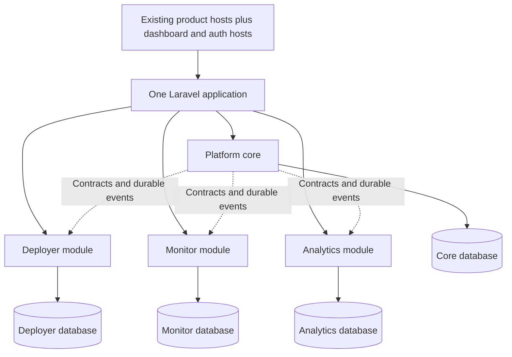

# Unified Buildpusher application plan

Prepared 23 September 2026. Implementation is in progress in `lessbuild/app` on `feature/unified-platform`, based on the current `origin/main`. The first foundation slice is pushed as commit `01855f9`; its [draft pull request](https://github.com/lessbuild/app/pull/1) is open for review. No production settings, data, subscriptions, or deployments have changed.

## Implementation status

The first foundation slice is in the `app` worktree: Core and peer product service providers, four named database connections with module model bases, Deployer route ownership under `app/Modules/Deployer`, optional exact-host configuration, and the Signal Topbar SaaS shell with reusable navigation and input primitives. The original Deployer database remains the default during this transition. Commit `01855f9` is pushed to `feature/unified-platform`, and draft PR #1 is open to `main`.

This is an architecture and UI foundation, not a completed merge. Deployer controllers and operational models still use their existing root namespaces; Monitor and Analytics features, canonical Core data, subscription separation, product connections, and legacy data import have not yet been migrated. The full feature-parity matrix and its evidence remain mandatory before cutover.

The target is **one Laravel application with a shared platform core and three product modules**, retaining each product's hostname, database, capabilities, and independent subscription. Use one repository, Composer dependency graph, frontend build, and release artifact. Run separate worker pools for different workloads from that artifact.

**Agreed source destination:** use [lessbuild/app](https://github.com/lessbuild/app) as the unified repository, develop on `feature/unified-platform`, and open a pull request into `main`. The existing Monitor, Analytics, and Signal repositories remain available throughout migration. This records the delivery destination; implementation code has not yet been pushed.

**Deployer is a peer product module.** Extract its product-specific functionality into `app/Modules/Deployer`, alongside `app/Modules/Monitor` and `app/Modules/Analytics`. The repository root hosts the Laravel platform; shared authentication, workspaces, canonical projects, and product-scoped billing belong in `app/Core`, rather than being owned by Deployer.

Confirmed requirements: subscriptions belong to a workspace/team, with a separate plan for each product; preserve existing accounts, projects, memberships, data, and subscriptions. Use Signal throughout, with its complete component/template library available to the application.

**Shared UI components and centralized theming are mandatory.** Panels, modals, buttons, inputs, and all other interface primitives must come from one reusable Signal component library used by Core, Deployer, Monitor, and Analytics. Future theme updates must propagate through shared tokens/components without editing individual product screens. The static UI concept illustrates layout only; its inline markup/styles are not the production component architecture.

**The selected application shell is Signal's actual Topbar SaaS shell.** This explicit user choice replaces the earlier sidebar application-shell choice. All authenticated Core, Deployer, Monitor, and Analytics screens must compose the same shared topbar shell, with brand, workspace, and product navigation at the top, contextual project/environment controls, and one product-local horizontal navigation area.

**Full feature preservation is mandatory.** Preserve every existing implemented capability in Deployer, Monitor, and Analytics, including capabilities not shown in the UI concepts. This includes customer and administrator screens, advanced settings, security controls, role-specific workflows, APIs, webhooks, provider integrations, background jobs, scheduled commands, notifications, imports/exports, reporting, retention, and operational tooling. Consolidating implementations or reorganizing navigation must preserve their behavior, access controls, data, and existing customer entitlements. Any proposed feature removal, reduction, or deferral beyond production cutover requires the user's explicit agreement.

The UI concepts are representative screen layouts, not the feature inventory or the complete navigation specification. Add the screens and navigation needed for the full existing feature set. Existing overlapping capabilities remain available until any consolidation demonstrably preserves their behavior and entitlements.

The Signal Topbar SaaS visual concept is retained in `docs/unified-ui-preview.md` with separate Projects, Deployer, Monitor, and Analytics screenshots. It demonstrates the shared shell, project/environment context, independent product status/plan summaries, project activity, and app connections using sample data; it is a review aid rather than live application behavior.

Before moving product code, create a feature parity matrix with one row per existing capability: source repository/commit, entry points and behavior, applicable roles/plans, data and integration dependencies, destination module/screen/route/job, migration requirements, regression evidence, and verification status. Include live configuration and workflows in the inventory; routes and current tests alone are not exhaustive. Check for upstream changes again before cutover so features added after this source review are not omitted.

For **each** feature, the migration checklist is:

- [ ] Identify current behavior, entry points, permissions, plan rights, and dependencies.
- [ ] Map the complete behavior to its destination in the unified application.
- [ ] Preserve associated data, settings, identifiers, integrations, and history.
- [ ] Implement its functional UI/API/job workflow, including relevant error and recovery states.
- [ ] Verify equivalent behavior and customer access with recorded regression evidence.

Feature preservation is a release gate: every matrix row must be verified, or covered by a specific user-approved exception, before replacing its production application. A passing dashboard demo or partial regression suite is not sufficient.

## 1. Findings that determine the approach

The source baseline is the default branch of each supplied repository, cloned for read-only inspection:

| Repository | Commit | Relevant finding |
| --- | --- | --- |
| [Deployer](https://github.com/lessbuild/app) | `210b7d1ffcd1c6b565383ae0213c414e84c673cf` | PHP ^8.5; locked Laravel 13.30.1, Livewire 4.4.4, Cashier 16.8.0. Organizations and projects exist, but entitlements come from the owner's user subscription named `default`. |
| [Monitor](https://github.com/lessbuild/monitor) | `c5b3d9a4870b5dc296837228c3209d946c7d0b4e` | Locked Laravel 13.32.0; Workspace → Application → Environment. Local auth and custom Stripe billing. Several queues must commit in the same database transaction as domain records. |
| [Analytics](https://github.com/lessbuild/analytics) | `d762d0286bc481423994c29ffe432fd1c4e16209` | Locked Laravel 13.32.0 and Livewire 4.4.6; Workspace → Site. Fortify configuration, public tracker/collection endpoints, and asynchronous ingestion. No subscription implementation or Project model found. |
| [Signal](https://github.com/lessbuild/template) | `438f8647361a11a32e974d00d491e67fba8efbcf` | Nunjucks/static HTML, Tailwind 4, theme tokens and browser behaviors. Five layout source files, 43 page source files, and 27 catalog entries across 11 component categories; the catalog is not an exhaustive count of markup components. |

Later shell reference, 23 September 2026: the user selected the Topbar SaaS shell added in Signal commit [`ad410b952e23ad9b045b91f44f396ab43a6d8583`](https://github.com/lessbuild/template/commit/ad410b952e23ad9b045b91f44f396ab43a6d8583), “Add sidebar and topbar SaaS shell examples.” Use [`src/layouts/topbar.njk`](https://github.com/lessbuild/template/blob/ad410b952e23ad9b045b91f44f396ab43a6d8583/src/layouts/topbar.njk) and [`src/pages/template-saas-topbar.njk`](https://github.com/lessbuild/template/blob/ad410b952e23ad9b045b91f44f396ab43a6d8583/src/pages/template-saas-topbar.njk) as the shell's structural and visual references. The table above remains the original source-audit baseline; its counts describe that earlier revision.

All three apps already have Signal adaptations. All three currently assume their identity, tenancy, and operational tables share the default database connection. None of these checked-out applications already provides the required unified identity/project core.

Use PHP 8.5 and a mutually compatible, tested Laravel 13 dependency set. Resolve a single lockfile rather than combining existing lockfiles. Keep Blade, Tailwind 4, Vite, and existing Livewire where useful. Verify actual runtime compatibility before selecting exact package versions.

## 2. Application and database ownership



There are **four databases**: a new core database plus the three existing product databases. Separate subscriptions are independently managed product subscriptions; they do not require three duplicate billing engines.

| Connection | Owns |
| --- | --- |
| `core` | Users, authentication, workspace membership, product access grants, canonical projects/logical environments, product/resource mappings, integration settings, shared preferences, product-scoped billing records and entitlement policy, dashboard summaries, platform audit records. |
| `deployer` | Repositories, servers, sites, deployment settings, workflow YAML, secrets, deployments, previews, and existing operational history. |
| `monitor` | Applications, monitoring environments, ingestion tokens, telemetry, checks, incidents, alerts, releases, and its transactional job queues. |
| `analytics` | Sites, verification records, collection batches, events, sessions/aggregates, reports, exports, retention data, and product jobs. |

Each module owns its models, actions, queries, policies, migrations, and writes. Shared identity and membership have one authoritative owner in Core. Where needed during migration, retain local workspace/user reference records as explicitly read-only projections, not independent accounts or passwords.

Name connections explicitly on models **and** raw DB/Schema calls, validation queries, migrations, transactions, jobs, and scheduler checks. Keep `core` as a stable default; never switch the global default connection based on the hostname. Audit joins, `whereHas`, relationship existence queries, cascade deletes, and implicit model serialization before separating tables. Laravel supports [named database connections](https://laravel.com/docs/13.x/database#using-multiple-database-connections).

Use separate database credentials, migration histories, and backups. Keep each product's existing database engine for the initial merge; engine changes are separate migrations. Local foreign keys remain within each database. Cross-database references use stable Core IDs, authorization checks, reconciliation, and lifecycle events. Do not rely on cross-database joins or foreign keys.

Database separation preserves data ownership, but the unified runtime and release remain shared failure boundaries. Retain an independently hosted external health check for the platform.

## 3. Shared authentication and retained subdomains

Configure explicit hostnames for `dashboard`, `auth`, `deployer`, `monitor`, and `analytics`. Keep existing production product URLs and public API paths. Deployer's repository currently documents `buildpusher.com` as its production origin, while Analytics documents `analytics.buildpusher.com`; verify the live host inventory rather than assuming Deployer already uses a particular subdomain. Dashboard/auth hostname choices are configuration decisions, not reasons to move existing URLs.

- Bind routes to exact configured hosts, with names such as `core.projects.show`, `deployer.projects.show`, `monitor.applications.show`, and `analytics.sites.show`. Register explicit product groups before catch-all routes. Laravel provides [domain route groups](https://laravel.com/docs/13.x/routing#subdomain-routing).
- Use one Core user provider, login flow, password reset flow, account-security area, and session revocation policy. Consolidate working Deployer security features and Analytics/Fortify behavior; do not infer working MFA/passkeys solely from configuration.
- For a trusted common parent domain, use a single Secure, HttpOnly, SameSite=Lax Laravel session cookie and shared session store/key across the new application's replicas. Audit the whole parent domain first: if customer-controlled sites/previews or independently trusted apps share it, use host-only sessions with established SSO instead of a parent-domain cookie. Keep legacy runtimes' cookies isolated during cutover.
- Place login on the auth host and allow return URLs only to configured platform origins. Bind social callbacks, reset/verification links, signed URLs, and any passkey RP/origin behavior deliberately. Preserve old callback endpoints until migration is complete.
- Preserve social identities, verification state, MFA/recovery behavior, and organization security restrictions. Account linking must prove ownership; matching email alone must not merge identities. Migrate supported password hashes without double hashing. Require a fresh login after cutover; preservation of accounts does not mean copying old sessions.
- Use explicit workspace/project context in URLs and requests. A global last-selected workspace is a convenience only: switching a second tab must not change the tenant targeted by an in-progress action. Jobs carry immutable workspace/project/product identifiers.
- Keep public collection, monitoring ingestion, heartbeats, provider webhooks, and public status pages on their appropriate token/signature/public access mechanisms. They must not acquire a browser login requirement. Scope host middleware, CSRF exceptions, CORS, throttles, and Livewire update/upload routes deliberately.

## 4. Canonical projects and authorization

The workspace owns the project. The project is created once and is discoverable across all three products, subject to membership and product permissions. Viewing a project does not automatically purchase or activate a product.

Core entities:

- `workspaces`, `users`, `workspace_memberships`, and `workspace_product_access`.
- `projects`: stable ULID, workspace ID, name, workspace-scoped slug, lifecycle state, and shared metadata.
- `project_environments`: logical shared identities such as production and staging; product-specific settings stay local.
- `project_products`: activation state for each project/product, including provisioning and failure state.
- `project_resources`: mappings from canonical project/environment IDs to one or more product-local resources.
- `project_connections`: explicit source/target resource and environment mappings, enabled capabilities, status, actor, and audit history.
- `legacy_identity_maps`: source system/entity/ID → canonical ID, with unique source mappings and reconciliation status.

Preserve existing numeric product IDs and public IDs; add canonical references rather than renumbering all operational data. Deployer project identity maps to a Core project while deployment settings remain local. Monitor applications and Analytics sites attach to Core projects, including projects without Deployer. Support multiple sites/applications per project instead of assuming a permanent one-to-one mapping.

Reconcile existing organizations/workspaces explicitly. Never merge projects just because names, domains, or owner emails match. Import independent projects first when correspondence is uncertain, then offer an authorized linking workflow.

Separate workspace administration, project/resource permissions, product access, and billing privileges. Map existing Deployer roles and Monitor/Analytics roles through an explicit capability matrix, preserving current access without widening it. Product seat limits count members granted that product's access; a Monitor limit must not block invitations to the shared workspace or access to Deployer.

Every command checks workspace membership, resource ownership, product permission, and the relevant entitlement. Cross-app links carry context but confer no authority. Archive/deletion uses a tracked lifecycle workflow: disable new activity, coordinate each module's cleanup/retention policy, and record acknowledgements. Subscription cancellation never deletes the shared project or another product's data.

## 5. Independent workspace subscriptions

Use a shared Billing domain with three product catalogs and separate subscriptions identified by `deployer`, `monitor`, and `analytics`. Each has its own prices, free tier if applicable, trial, quantities/seats, feature limits, usage, renewal, cancellation, dunning, and grace-period rules. Do not put a global `plan` column on the Core workspace.

For a new workspace on one Stripe account, a single customer can have three independent named subscriptions; Cashier supports [multiple subscription types](https://laravel.com/docs/13.x/billing#multiple-subscriptions). Select the billable workspace/account model explicitly. A user owning two workspaces must not accidentally give both the same subscription.

Keep product-independent billing machinery in Core. Product modules own usage measurement and product capability definitions; Core supplies typed entitlement results. Plan gates apply to UI, APIs, queued work, integration actions, and collection where relevant, not just navigation. Reserve/check operational quotas atomically within the owning product database so concurrent requests cannot both consume the final slot. Reserve product seats and create product-access grants atomically in Core, where those memberships/grants live.

Migration details:

1. Inventory actual provider accounts, customers, subscriptions, prices, trials, quantities, payment methods, invoices, and billing periods. Repository code alone cannot establish production billing state.
2. Preserve existing provider/customer/subscription IDs and commercial terms. Import local representations without calling subscription creation, cancellation, or charging APIs. Reconcile against provider state before enabling checkout.
3. Deployer's owner-user `default` subscription needs an explicit workspace assignment. If it currently covers multiple organizations, preserve that access with a documented legacy entitlement mapping until an owner chooses a new billing arrangement; do not create extra charges or silently remove access.
4. Monitor's custom Stripe billing and workspace plan state move through an adapter to the common model. Keep its existing plan catalog and feature rights. Analytics requires a new billing/entitlement implementation; honor any production agreements discovered during inventory.
5. Model billing customer mappings separately from workspace identity so multiple legacy customers/provider accounts can coexist. A single Cashier `stripe_id` must not overwrite those records. Use migration adapters for legacy subscriptions; a common customer is a target for eligible new billing, not a prerequisite for preserving existing subscriptions.
6. Route webhooks by provider account, product, and subscription identity. Remove Monitor's customer-only fallback when ambiguous. Verify signatures, deduplicate events, handle stale/out-of-order delivery, and reconcile current provider state. Enforce at most one current subscription per workspace/product without discarding historical records.

Dashboard billing shows three independent product cards and supports per-product management. Ending Monitor changes Monitor entitlements only. Shared projects/authentication and the other subscriptions remain available. Agree exact unpaid/read-only/ingestion behavior per catalog before release and test it.

Preserve Deployer's existing health checks/status/incident entitlements while mapping feature ownership; overlapping features must not disappear or become a second charge merely because Monitor joins the application.

## 6. Connections and reliable cross-app workflows

Users connect apps from a project's Connections screen, selecting resources, environments, and enabled behaviors. A connection has explicit permission and entitlement checks on both ends, last successful sync, visible errors, retry controls, and a disconnect action. Disconnect stops future automation without deleting either app's history or changing subscriptions.

First integration slice:

- Deployer's completed deployment emits a versioned `DeploymentSucceeded` event containing event ID, workspace/project/environment IDs, deployment ID, revision, timestamp, and permitted endpoint metadata.
- Monitor consumes it to record release/deployment context using its existing `RecordDeployment` behavior and deduplication. Add an explicit authorized integration actor; the current action accepts exactly one user or ingestion token.
- Analytics consumes it to create a release annotation associated with connected sites; this is new Analytics functionality.
- Monitor incident-opened/resolved events can annotate connected Analytics timelines, while an Analytics summary contract supplies traffic context to Monitor investigations. These are new, optional connections that complete the useful pairings between the three products.
- The dashboard combines deployment, health, traffic, and connection summaries with links back to the product screens.

Later slices can provision Monitor applications/Analytics sites and propagate verified endpoint changes. Do not claim a successful deployment automatically verifies an Analytics domain, installs a tracker, or grants ingestion credentials. Those steps need their actual provisioning/verification mechanisms. Automatic rollback or destructive infrastructure changes are outside the initial integration behavior.

Use small typed contracts for immediate reads/commands and versioned durable events for cross-database workflows. Persist each event in an outbox **in the same database transaction as its source change**. A dispatcher delivers it at least once; consumers store an event/handler receipt in the same local transaction as their effect. Use unique resource mappings and idempotency keys, retry/backoff, failure visibility, and replay/reconciliation commands. Include aggregate versions where out-of-order delivery could overwrite newer state, and prevent integration loops.

`afterCommit` is useful scheduling behavior but does not close the crash window between a successful database commit and publishing to another service. Laravel documents [queue transaction timing](https://laravel.com/docs/13.x/queues#jobs-and-database-transactions); the outbox is an additional application design choice.

Core project creation and product provisioning are separate transactions: show `pending → ready` or `failed/retryable`. An unavailable Monitor database cannot undo a completed deployment. Consumers recheck the connection, target mapping, authority, and applicable entitlements before applying a queued integration.

## 7. Dashboard and Signal UI

The dashboard includes workspace/project switchers, project directory, project overview, per-product activation/plan states, recent activity, connections, team access, account/security, and billing. A project overview shows latest deployment, monitoring health, and Analytics summaries with freshness timestamps. Use lightweight summaries/projections and bounded reads; show a product-specific unavailable state when one module fails instead of failing the whole dashboard. Raw telemetry/event tables are not dashboard join targets.

Use the selected Signal Topbar SaaS shell consistently across all authenticated application screens:

- Port the actual upstream topbar layout and context strip into a shared `x-signal.layouts.topbar` composition. Keep brand, workspace selection, product navigation, and shared account/actions in the top header, using Signal's tokens, spacing, surfaces, and responsive behavior.
- Show project/environment context where applicable, with exactly one product-local horizontal navigation area. Use authorized grouped or overflow menus for advanced destinations rather than duplicating product navigation in stacked tab rows or introducing product-specific sidebars.
- Keep Projects, Connections, Subscriptions, and account destinations reachable at desktop and mobile sizes. The responsive menu must retain Connections, Subscriptions, account/security, and workspace switching; long names and narrower widths must not hide them. The Projects directory and Subscriptions/billing screens remain workspace-scoped and must work without a selected project. Project-scoped connections retain their explicit project/environment context.
- Componentize the brand, top header, workspace/product navigation, context controls, local navigation, account actions, and responsive menu once. Product screens supply authorized navigation/data through props and slots, without copied shell markup, sidebar clones, or per-product theme overrides. Keep upstream sidebar examples available in the complete development gallery while using the selected topbar shell for the application.

Create one shared Signal design system from the supplied template and reconcile the existing three ports against it:

- Port Nunjucks layouts/partials to Blade components with explicit props/slots, preserving semantic tokens, icons, light/dark/system modes, graphite/default configuration, typography, spacing, density, contrast, reduced motion, and responsive navigation.
- Inventory **every** source component, block, layout, template, and behavior, not only `components.json`. Maintain a source-to-Blade mapping with covered states and remaining gaps. Preserve the complete library in a development-only gallery, including templates without a current product screen.
- Use application/dashboard templates for project management; deployment templates for Deployer; operations/incident/runbook templates for Monitor; chart/dashboard templates for Analytics; pricing, settings, onboarding, notifications, authentication, recovery, and errors across the platform. Keep the remaining templates reusable without inventing unrelated product features.
- Consolidate existing `x-ui` components and app-specific adapters instead of maintaining three CSS/markup forks. Pin the upstream template commit and record future updates.
- Replace demo form/localStorage behaviors with real Laravel validation, authorization, persistence, loading/error states, pagination, and data. Make browser modules safe to initialize after Livewire navigation without duplicate handlers or conflicting DOM ownership.
- Persist user theme preferences in Core and render them on every host. localStorage can cache a host's presentation preferences but does not synchronize different subdomains.
- Preserve the PWA components/templates, but allowlist only safe public/static resources for caching. Authenticated dashboards, reports, secrets, billing, and API data stay network-only/private; clear applicable cached identity context on logout.

Verify representative screens in light/dark modes, mobile/desktop, keyboard-only navigation, and with real empty/loading/validation/permission states. Check visual parity against Signal's selected Topbar SaaS reference, including accessible dialogs and menus. Verify every advanced destination from the feature parity matrix remains reachable through the topbar/local navigation or its labeled menus at every supported breakpoint, with visible focus, correct active state, keyboard opening/dismissal, and focus return. Check that product switches preserve authorized project/environment context, workspace-scoped Projects/Subscriptions need no project selection, and only one product-local navigation area is rendered.

### 7.1 Approved product improvements

The user approved all fourteen improvements below. They are implementation scope in addition to full feature preservation. Integrate them with existing equivalent capabilities where available; do not create duplicate dashboards, notification systems, or job execution engines. Delivery phases identify dependencies and order, not permission to omit approved work. Existing capabilities remain mandatory at cutover even when an enhancement to them is scheduled for phase 7.

| ID | Improvement | Delivery | Behavior and acceptance checks |
| --- | --- | --- | --- |
| I1 | Guided project setup | Establish in phase 2; complete product checks in phase 5. First priority. | Show actionable steps for connecting a repository, completing a deployment, receiving Monitor data, verifying an Analytics site, and receiving tracker events. Include only the products/resources the workspace chooses to enable. Recognize imported resources, allow linking without recreation, and let users resume setup. Mark steps complete from verified product state rather than a dismissed prompt; setup must not purchase another subscription implicitly. |
| I2 | Visible progress for connected workflows | Phase 5. First priority. | Present a correlated run such as `Deployment successful → Monitor updated → Analytics annotated`, with per-step timestamps and states. Preserve source success when a downstream step fails. Explain failures, allow authorized retry of only the failed step, and support pausing automation without disconnecting resource mappings or erasing history. Verify replay cannot duplicate effects and permissions/entitlements are rechecked. |
| I3 | Unified notification inbox | Phase 7, preserving all existing notification behavior through cutover. | Group related deployment, incident, and recovery messages into a project/environment thread with links to the original product records. Persist read state and preferences by project, product, and severity. Retain existing delivery channels and escalation behavior; deduplication or preference migration must not silently suppress actionable alerts. Check authorization after membership changes and provide accessible read/unread and empty/error states. |
| I4 | Global search and keyboard navigation | Shared shell in phase 2; complete product search adapters in phase 5. First priority. | Extend Signal's command palette to locate projects, servers, deployments, incidents, Analytics sites, and advanced settings. Preserve workspace/project context when navigating. Filter both results and result counts by current authority, reauthorize destination actions, and exclude secrets from indexes/snippets. Verify keyboard operation, focus management, revoked access, and usable partial results when one product is unavailable. |
| I5 | Before-and-after release comparisons | Phase 7, after mappings and migrated data are validated. | Compare latency, errors, traffic, and conversions around a selected release using the same project/environment, defined metric semantics, and explicit time windows/timezone. Show sample coverage, missing/stale data, overlapping incidents/releases, and links to source investigations. Describe observed changes without asserting causation. Verify calculations against source reports and preserve each product's permissions and retention rules. |
| I6 | Clear product usage and access management | Phase 3. | Give each product its own usage meters, limits, renewal details, and billed-seat view. Explain a teammate's effective workspace/project/product access and the potential seat impact before granting another product. Enforce grants and seat reservations atomically in Core and operational quotas in product databases. Verify one product's limits, role changes, or cancellation cannot change another product's access or billing. |
| I7 | Saved views and actionable dashboard priorities | Foundations in phase 2; complete in phase 5. | Persist pinned projects and named filters with explicit personal or workspace visibility. Surface failed deployments, active incidents, broken connections, and unfinished setup alongside summaries. Preserve existing advanced navigation and reports. Reauthorize saved views on every use, distinguish stale data from healthy/empty results, and retain state across app switches and sessions. |
| I8 | Shared background-task center | Phase 5, sharing the run/status foundation with I2. | Let users return to deployments, exports, provisioning, and syncs after leaving a page. Show queued/running/completed/partially failed/failed states as applicable, progress when measurable, result links, and permitted retries. Reuse each module's execution and durability guarantees; the center is an authorized view of work, not a replacement queue. Check tenant isolation, reload persistence, truthful unknown progress, expired export links, and retry behavior. |
| I9 | Shared environment selector | Establish in phase 2; verify all product mappings in phase 5. First priority among the second set of improvements. | Keep Production, Staging, and Preview context explicit and consistent across app switches, deep links, actions, and queued work. Require deliberate mappings between canonical and product-local environments. Show a missing/unavailable mapping instead of silently selecting production. Verify staging activity cannot enter production reports, comparisons, or alerts, and a switch in another tab cannot retarget an operation. |
| I10 | Connection diagnostics | Phase 5, using the same operation IDs as I2/I8. First priority among the second set of improvements. | Explain missing permissions, expired credentials, absent incoming data, exhausted limits, and failed syncs with last successful activity, freshness, and relevant next actions. Redact secrets and restrict details by current project/product authority. The default view reads diagnostic state; any explicit connection check uses existing outbound-target protections and must not trigger a deployment, purchase, or unrelated notification. Verify unavailable/stale information is distinguished from healthy state and fixes recheck authorization. |
| I11 | Reusable project blueprints | Phase 7; retain existing recipes/workflows in phase 4. | Combine existing deployment recipes with optional Monitor checks and Analytics setup in versioned project definitions. Preview resources, environment mappings, changes, and applicable plan/quota impact before applying a blueprint. Use existing module contracts and durable provisioning workflows; support partial failure, resumption, and idempotent retries. Supply secrets separately and perform actual domain/tracker verification. Verify a blueprint cannot copy active subscriptions, bypass limits, duplicate existing resources on retry, or mark an unverified domain as verified. |
| I12 | Visual project resource map | Phase 5, after canonical resource mappings are validated. | Display repositories, servers, deployments, monitoring applications, and Analytics sites with their environment and relationships; provide deep links to the authorized management screens. Derive the map from existing resource mappings and module summaries rather than a second ownership model. Filter nodes, relationship edges, counts, and details by current permissions. Provide a keyboard-accessible list/table alternative and explicit missing/stale/unavailable states. Verify shared resources are represented without exposing another project's private relationships. |
| I13 | Consistent developer API experience | Preserve existing endpoints/token behavior in phase 4; deliver consolidated developer tools in phase 7. | Provide one documentation area with versioned API contracts, scoped credential management, webhook delivery history, and integration examples. Standardize new APIs while retaining existing endpoint, payload, and authentication compatibility. Token abilities must be combined with explicit workspace/project/product policies and entitlements; browser login does not grant machine access. Verify revocation, expiry, idempotency, pagination, rate limits, and documented errors. Keep webhook payload previews redacted, use signed deliveries, and make authorized retries safe against duplicate effects. |
| I14 | Project handover and portability | Phase 7, using verified identity/resource mappings. | Export a versioned project manifest containing permitted resource/environment mappings, configuration references, ownership, and setup instructions, excluding secrets and authentication credentials from ordinary exports. Include an import-validation/dry-run report identifying missing providers, shared resources, unresolved references, and destination permissions/limits without provisioning or changing ownership. Preserve stable source identity references and distinguish the manifest from a full backup. Check export authorization, sensitive-field exclusions, schema compatibility, and destination validation. Subscriptions remain workspace-owned; the manifest prepares for future workspace transfers and does not itself perform a transfer or move billing. |

Core owns user preferences, saved-view definitions, authorized task/workflow summaries, and inbox presentation state. Product modules retain authoritative jobs, operational events, detailed results, usage, and metric calculations. Summary updates use the established contracts/events; task, search, and notification views cannot bypass product policies or expose operational secrets. I2 and I8 share operation/correlation identifiers rather than tracking the same work independently.

I9–I14 build on the same canonical project/environment identities and public module contracts. The resource map and handover manifest are views of existing ownership; blueprints orchestrate module-owned provisioning. Diagnostics reuse workflow evidence, and shared developer tools preserve existing product-specific ingestion credentials and APIs. These additions must not introduce cross-database joins, duplicate resource authorities, or implicit subscription changes.

### 7.2 Approved engineering improvements

- Introduce workspace-scoped rollout controls for **new** UI/workflows, using [Laravel Pennant](https://laravel.com/docs/13.x/pennant) or a compatible existing abstraction. Start with internal/pilot workspaces, record exposure and failures, and expand only after the relevant gates pass. Feature flags do not grant entitlements, hide required legacy capabilities without an equivalent route, switch authoritative database writers, or reverse schema/data migrations. Pausing an integration must define how pending work is handled and retain its history.
- Add CI architecture checks for forbidden direct imports/writes between product modules, supported by integration tests of connection isolation and module contracts. Permit cooperation through the defined public contracts and Core services. Include new raw DB queries, jobs, migrations, and validation paths in review; model namespaces alone do not prove database isolation.

### 7.3 Mandatory component architecture and theme maintenance

Use one shared Blade component namespace, `x-signal.*`, backed by `resources/views/components/signal/*`, shared theme assets, and shared interaction modules. Reconcile existing `x-ui` components through reusable adapters during migration, then converge on the common implementation. Product pages compose components and supply authorized data/actions; they do not duplicate visual primitives or maintain their own versions of the theme.

| Component family | Required reusable coverage |
| --- | --- |
| Layout and surfaces | Shared Topbar SaaS application shell, top header/context strip, public/auth layouts, page heading, sections, stacks/grids, panels, cards, dividers, toolbars, responsive containers; upstream alternative shells retained in the development gallery. |
| Actions and navigation | Brand/workspace/product topbar navigation, one product-local horizontal navigation area, responsive menu, account actions, buttons, icon buttons, links, dropdown actions, tabs, breadcrumbs, pagination, workspace/project/environment selectors, command palette. |
| Forms | Field wrapper, label, description, validation error, text/password/search/number inputs, textarea, select/combobox, checkbox, radio, switch, date/range controls, file input, form groups and action rows. |
| Overlays and feedback | Modals/dialogs, confirmation dialogs, drawers, popovers, tooltips, alerts, toasts, banners, progress, spinners, skeletons, empty/error/permission states. |
| Data presentation | Table and its header/row/cell compositions, filters, badges/status indicators, avatars, metric cards, descriptions, timelines, lists, charts/legends/tooltips, log/code viewers. |
| Product compositions | Deployment/environment cards, health/check rows, incident summaries, analytics report panels, connection/task status, subscription/usage cards, resource maps, and setup steps composed from the shared primitives. |

This list is a minimum, not the complete catalog. Every existing feature and every upstream Signal component/template must map to a shared primitive or a product composition; raw markup in the concept is not an exemption. Preserve semantic HTML within components and avoid unnecessary abstractions around non-repeated content.

Component rules:

- Expose small, documented APIs using explicit props, variants, sizes, named slots, and forwarded attributes, including Livewire bindings where applicable. Prefer compositions over components with many unrelated mode flags. A reusable button's appearance and states live in one place; adding a product button must not require copying its markup/CSS.
- Components own consistent accessibility: appropriate button/link semantics, labels and unique field IDs, help/error associations, focus visibility, modal focus trapping/return, keyboard navigation, dismissal, and announced loading/error states. Support default, hover, focus, active, disabled, loading, invalid, read-only, and empty states where relevant.
- Blade components own presentation. Livewire or focused shared browser modules own the appropriate interaction state; domain actions, authorization, validation rules, and database queries stay outside presentation components. Use one owner for each interactive behavior and verify cleanup/reinitialization after Livewire navigation without duplicated handlers.
- Centralize colors, status/chart palettes, typography, spacing/density, control sizes, borders, radii, shadows, motion, and layering in semantic Signal tokens. Define light/dark/contrast variants centrally. Charts and overlays must consume the same theme as forms and panels.
- Allow layout composition at the page level, but keep theme styling in tokens/components. Product pages must not hardcode brand colors, recreate controls, override component internals, or load their own theme copies. When a legitimate new variant is needed, add it to the shared component API and gallery; isolate any unavoidable third-party widget styling in a shared themed adapter.
- Keep the full component gallery and template compositions as the reference, showing documented props/slots, usage, interaction states, responsive behavior, and light/dark modes. Map upstream Signal files to their consuming components, pin the source revision, and review upstream changes against this mapping instead of overwriting application templates blindly.
- Build/version shared assets once per release and serve that artifact across all configured hosts. Preserve compatible component contracts during migration; update consumers together when a contract changes. Existing user theme preferences resolve through the common tokens.

Acceptance gates: in phase 1, prove the architecture by changing a representative token set (color, radius, typography/density) and a shared button/panel variant, rebuilding once, and verifying the change on Core, Deployer, Monitor, Analytics, and public/auth layouts without editing their page templates. During product migration, verify all screens use the shared library with equivalent features and interaction behavior. Add focused accessibility/interaction tests and visual comparisons for shared components and representative app screens; review for duplicated primitives, raw theme values, and per-app overrides. Theme changes must not alter permissions, billing behavior, data, or feature availability.

## 8. SOLID and Laravel implementation conventions

Use `app/Core/*` for shared platform capabilities and `app/Modules/{Deployer,Monitor,Analytics}/*` for the three peer product modules, with module route files, explicit service providers, connection-scoped migrations, and shared `resources/views/components/signal/*`.

```text
app/
  Core/                         # Identity, workspaces, projects, billing, platform services
  Modules/
    Deployer/
    Monitor/
    Analytics/
resources/
  views/components/signal/      # Shared UI primitives and layouts
  css/signal/                   # Shared theme tokens and component styles
  js/signal/                    # Shared UI interactions
tests/
  Core/
  Modules/
    Deployer/
    Monitor/
    Analytics/
```

Each module owns its controllers, requests, models, policies, actions/services, jobs, events/listeners, routes, product configuration, product views, and database migrations. Use module-local `Routes`, `Config`, `Resources/views`, and `Database/migrations` directories as applicable, registered through its service provider; keep tests in the corresponding `tests/Modules` area. Product views compose shared Signal components. Preserve Laravel's bootstrap and genuinely shared infrastructure outside product modules.

Apply the same rules to Deployer as to the imported products: its operational models use the `deployer` connection, its routes have the configured Deployer host and name prefix, its jobs retain explicit product context, and other modules access its capabilities through public contracts/events. Existing Deployer controllers/models/services must be classified and moved into Deployer or Core rather than left as a privileged root implementation. Preserve old route compatibility and safely drain/translate serialized jobs during namespace changes. Existing applied migrations remain immutable; register or supplement them deliberately as part of the migration design.

- Single responsibility: small controllers/Livewire handlers, Form Requests for validation, policies for access, and focused actions for business operations.
- Open/closed: register a product's routes, capabilities, billing catalog, and summary provider through a product definition instead of adding product conditionals throughout Core.
- Substitution/interface segregation: narrow contracts such as `ProjectSummaryProvider`, `DeploymentContextRecorder`, and `ProductEntitlements` with explicit DTOs/results; avoid one enormous product interface.
- Dependency inversion: constructor/method injection at module and external-service boundaries, bound through service providers. Product modules do not import each other's Eloquent models or write directly to each other's tables.
- Reuse Eloquent within a module; do not wrap every model in a generic repository. Use typed properties/returns, enums for product/state values, factories, explicit transactions, named routes, scoped queries, and connection-aware migrations.
- Add architecture checks for forbidden cross-product imports plus meaningful behavior/contract tests. Use the existing PHPUnit/Pint conventions and relevant repository rules.

## 9. Delivery sequence and acceptance gates

| Phase | Deliverable | Gate before continuing |
| --- | --- | --- |
| 0. Inventory and migration design | Complete feature parity matrix and route/schema/role/Signal catalogs; production host/provider/runtime inventory; identity and workspace mapping rules; data volume and downtime estimates; tested backup/restore procedure. | Every existing capability has a destination and verification plan; legacy URLs, customer rights, encryption keys, job formats, and ambiguous mappings are accounted for. Source findings are distinguished from production evidence. |
| 1. Unified foundation | `feature/unified-platform` in `lessbuild/app`; compatible dependencies; separate Core plus peer Deployer/Monitor/Analytics module registrations; explicit hosts/connections; shared Signal component library, selected Topbar SaaS shell, theme tokens, gallery, and template compositions; isolated worker configuration; workspace rollout controls and architecture checks. | Routes do not collide; all four connections stay isolated in HTTP and jobs; topbar desktop/mobile/keyboard navigation, representative template parity, and the cross-app theme-update rehearsal pass; rollout flags cannot bypass authorization or entitlement checks. |
| 2. Identity and projects | Core users/workspaces/capabilities/projects, account security, shared login, migration mappings, product resource links, basic dashboard, and foundations for guided setup (I1), command search (I4), saved views (I7), and the shared environment selector (I9). | Existing identities/memberships import without automatic email merges or privilege escalation; cross-host navigation retains the intended authorized project/environment; new views honor current access. |
| 3. Billing boundaries | Workspace/product catalogs, entitlement contracts, legacy billing adapters, webhook routing, independent management screens, Analytics plan support, and product usage/access management (I6). | Preserved subscriptions reconcile without charges; cancel/upgrade/trial on one product cannot affect another; product seats are isolated; displayed access and usage match enforcement. |
| 4. Product migration | Extract Deployer from the existing root product code into `app/Modules/Deployer`, then migrate Monitor and Analytics into their peer module folders using Core and their own databases. Apply explicit DB boundaries and complete screens/navigation composed from shared Signal components. | Every migrated product's feature parity matrix is verified alongside its regression suite, queue durability, public endpoints, retention, exports, and existing entitlements. Confirm Deployer follows the same module boundaries and shared component rules as Monitor/Analytics. Complete shared platform/security wiring before exposing a module. |
| 5. Connections and full dashboard | Outboxes/receipts, deployment-to-Monitor context, Analytics annotations, integration settings, summaries, retry/reconciliation UI; complete I1/I4/I7/I9 and implement workflow progress (I2), task center (I8), connection diagnostics (I10), and the visual resource map (I12). | Duplicate/out-of-order delivery is safe; a target outage cannot invalidate the source success; disconnect/revocation takes effect; the acceptance checks for I1/I2/I4/I7/I8/I9/I10/I12 pass. |
| 6. Rehearsal and cutover | Sanitized production-like import, reconciliation reports, backup recovery drill, rehearsed traffic/write handoff, monitoring, rollback procedure; final feature inventory reconciliation against current source and production. | No unapproved feature gaps or unresolved ownership/data/billing discrepancies; agreed interruption window and recovery thresholds met. |
| 7. Connected-product enhancements | Unified notification inbox (I3), before-and-after release comparisons (I5), reusable project blueprints (I11), consolidated developer API tools (I13), and project handover manifests/validation (I14), reusing existing capabilities and verified resource mappings. | I3/I5/I11/I13/I14 acceptance checks pass; existing channels, recipes, reports, and APIs retain parity; comparisons disclose coverage; provisioning retries are safe; manifests exclude secrets and do not transfer billing. |

Land reviewable vertical slices within each phase. Early interfaces may use fakes for development, but phase completion requires real product behavior and migration validation. Keep old applications available until the new system has passed the full rehearsal.

## 10. Data preservation and production cutover

1. Snapshot all databases and required object/file storage; retain old releases/configuration and relevant encryption/signing keys in a controlled migration context. Record source commits, data counts, IDs, job backlogs, billing reconciliation, and tracker/token identity.
2. Add nullable canonical reference columns and mapping tables through new migrations. Backfill in bounded, restartable batches and validate ownership before enforcing constraints. Do not rewrite historical migrations or recreate populated databases.
3. Reconcile users/workspaces/projects using source-qualified IDs. Preserve historical memberships/audit actors. Stage duplicate-email identities separately and retain source-aware authentication/claim adapters until ownership is resolved; one email-based login cannot silently choose a legacy account. Require proof of the identities being linked and resolve collisions before enforcing a unique normalized primary email in Core. Preserve product rights under explicit legacy mappings until any commercial change is agreed.
4. Migrate encrypted provider credentials, environment variables, workflow YAML, alert destinations, SSO/MFA material, and related data with source-key-aware decryption and controlled re-encryption. Preserve Monitor deployment fingerprint compatibility. Preserve Analytics' visitor key explicitly; it currently falls back to APP_KEY, so changing only APP_KEY would change visitor identity.
5. Preserve tracker public IDs, verification state, API/ingestion tokens, idempotency keys, historical resource IDs, report files, and supported public endpoints. Existing `/tracker/v1.js` and `/api/v1/collect/{publicId}` integrations must continue working without requiring edits on customer sites.
6. Keep a single authoritative writer per migrated entity. Rehearse an initial import plus a bounded final write pause/delta catch-up. Continue collection on the designated old writer until its handoff, or use an explicitly durable tested buffer; do not silently drop ingestion. Avoid uncoordinated dual writes.
7. Drain or explicitly translate/version serialized jobs before changing namespaces/IDs. Run only one scheduler owner for each task during handoff. Route billing webhooks to one authoritative handler with safe replay, preserving external callback URLs.
8. Validate the final delta, change traffic routing, require fresh browser sessions, and monitor authentication, billing reconciliation, collection acceptance, queue lag, failed integrations, and product health.
9. Maintain old read-only data and backward-compatible schema/code during stabilization. Before new writes begin, routing can be rolled back to the old writer. After new writes, rollback requires a tested reverse-delta/catch-up procedure or a forward fix; restoring an old snapshot alone would lose accepted data. Fence/drain the new HTTP writers, workers, schedulers, webhook consumers, and outbox dispatchers before returning authority. Preserve consumer receipts, delivery checkpoints, and provider idempotency keys so recovery does not repeat external effects. Remove legacy tables/adapters only after reconciliation and an agreed retention window.

Keep Monitor's telemetry/check/alert database queues attached explicitly to `monitor` initially: their transaction guarantees are part of existing behavior. Refactor the guards in `TelemetryQueue`, `MonitorQueue`, and `AlertDeliveryQueue` to inspect the explicit Monitor connection and transaction level; changing configuration alone would leave their default-connection checks rejecting work when Core is the default. Give Deployer, Analytics, notifications, and integrations separate named queues/worker pools as appropriate. A forced move of every queue to Redis is not part of the merge.

## 11. Verification required for implementation

- Verify every authenticated Core/product screen uses the shared Signal Topbar SaaS shell from the recorded reference, with brand/workspace/product navigation above explicit context controls and one product-local horizontal navigation area. Preserve the complete advanced feature navigation on mobile and desktop, including Connections, Subscriptions, account/security, and workspace switching. Test keyboard access, focus/active states, overflow menus, long names, and project-independent access to the workspace Projects directory and billing screens; reject copied product shells and sidebar application-shell regressions.
- Verify the mandatory shared component architecture in section 7.3: one token/component change propagates across all product and shared layouts after a single rebuild, without page-by-page edits. Check variant/state coverage, accessible modal/form behavior, Livewire navigation, chart theming, mobile layouts, and absence of duplicated product theme implementations.
- Verify every feature parity matrix row, including advanced/admin screens and non-UI workflows. Record source-to-destination regression evidence and any specific user-approved exceptions; do not substitute the mockup navigation or existing test coverage for the full inventory.
- One login works across configured product hosts; logout/session revocation and workspace security requirements apply everywhere. Test allowed redirects, callbacks, signed URLs, wrong hosts, and preserved API access independently.
- Inventory and test working password, social, MFA/recovery, SSO, and passkey flows separately. Verify enrollment compatibility with the selected auth host/RP; provide an authenticated re-enrollment/recovery path wherever existing credentials cannot transfer. Treat configured but incomplete Analytics features as unverified, not preserved capabilities.
- Two workspaces with similarly named projects and colliding legacy numeric IDs remain isolated. Tampered IDs, cross-product links, and queued requests cannot bypass policies. Multi-tab workspace switching cannot retarget an action.
- Real product billing enforcement is enabled in acceptance tests; Deployer currently disables entitlement/limit enforcement in test defaults. Test independent trials/upgrades/cancellations, grace periods, seat quantities, last-slot concurrency, duplicate checkout, historical customers, and webhook retries/order.
- Four isolated database connections use the production engines in integration CI. Verify raw queries/validation/transactions, queue connections, migrations, factories, and cleanup behavior; a one-database SQLite suite is insufficient evidence for database separation.
- Preserve deployment behavior, provider callbacks, Monitor ingestion/deployment deduplication, transactional job recovery, Analytics origin validation/batch deduplication, visitor identity, retention, and exports.
- Test crash/retry points around outbox delivery and consumer transactions, revoked connections, stale events, and partial module outages. Dashboard degrades gracefully; core-sensitive actions fail closed when authority cannot be checked. Any ingestion entitlement projection/grace policy must be explicit and tested.
- Verify I1–I8 against their acceptance checks, including permission-filtered search/counts, resumed setup, independent seat impacts, durable visible workflow progress, authorized saved views, notification grouping without lost alerts, and source-consistent release comparisons. Test feature-rollout and subscription-entitlement decisions independently.
- Verify I9–I14 against their acceptance checks, including environment isolation and missing mappings, redacted diagnostics and resource-map edges, blueprint dry runs and partial-failure recovery, legacy API compatibility and token revocation, and authorized/versioned handover manifests with destination validation. Confirm none can implicitly activate subscriptions, copy verification authority, or expand access.
- Run existing product regression suites plus the new cross-product feature/contract tests; run formatting/static analysis where configured, frontend production build, route/config/event cache checks, and browser accessibility/visual flows.
- Compare import counts, identity/resource maps, access rights, retained secrets' decryptability, billing terms/IDs, and representative historical records. Rehearse restore and post-write recovery before launch.

## 12. Implementation inputs still to verify

Workspace-owned product subscriptions and preservation of existing data are confirmed. Production hostname/trust boundaries, actual database engines/volumes, provider accounts and agreements, current live authentication setup, billing owner ambiguities, and acceptable cutover interruption require operational inventory before implementation is scheduled. Exact Analytics pricing and rules also need a product decision. These do not prevent designing the common architecture, and no production values have been inferred from local sample configuration.

Key source evidence, relative to each repository: Deployer `app/Models/User.php`, `app/Services/Entitlements.php`, `app/Actions/Project/CreateProjectAction.php`, `app/Actions/Billing/CreateBillingCheckoutAction.php`; Monitor `app/Services/Telemetry/TelemetryQueue.php`, `app/Services/RecordDeployment.php`, `app/Services/ProcessStripeBillingEvent.php`, `app/Services/WorkspacePlanLimits.php`; Analytics `app/Actions/Collection/AcceptEventBatch.php`, `app/Jobs/ProcessEventBatch.php`, `config/analytics.php`, `config/fortify.php`, and `public/tracker/v1.js`; Signal `src/data/components.json`, `src/layouts`, `src/pages`, `src/styles`, and `src/scripts`.
