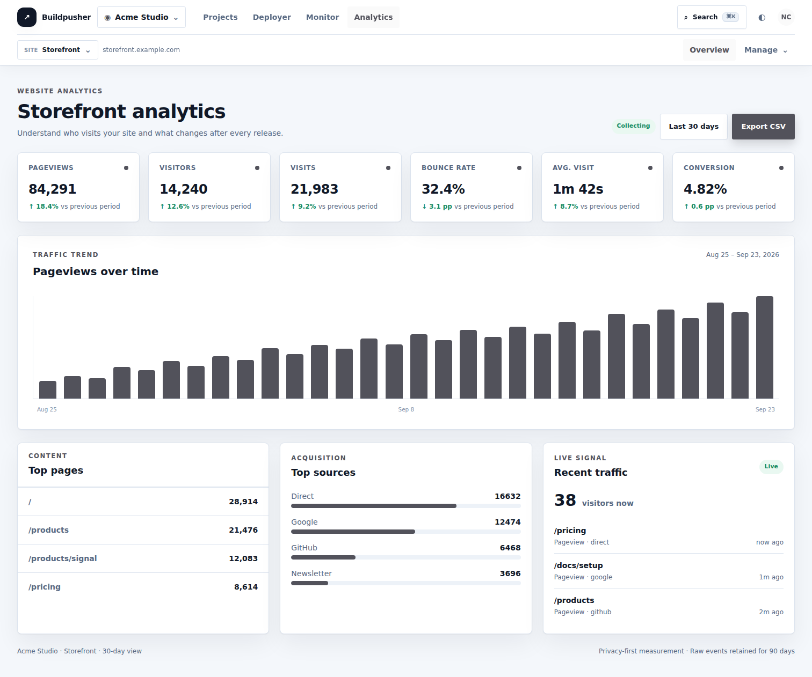

# Unified app UI preview

These screens use Signal's two-row Topbar SaaS shell. The first row carries the brand, workspace switcher, product navigation, and quick actions. The second row pairs the current resource context with product navigation; it shows project and environment controls where they apply, and a Site selector in Analytics.

The screenshots use sample data and are visual review artifacts, not live application screens. The latest Analytics shell rendering uses the production Signal CSS and graphite palette. Monitor and Analytics remain gated while shared authentication, canonical projects, billing, and data migration are unfinished.

## Analytics with the shared shell

## Projects dashboard

## Deployer

## Monitor

## Analytics

