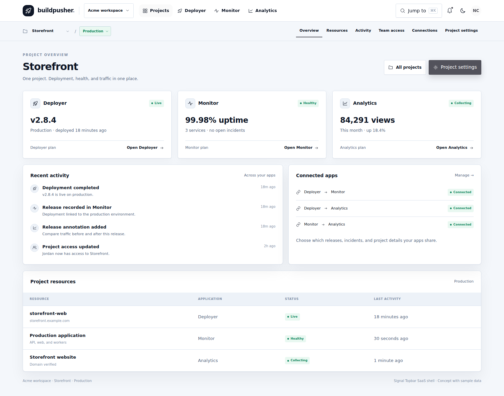
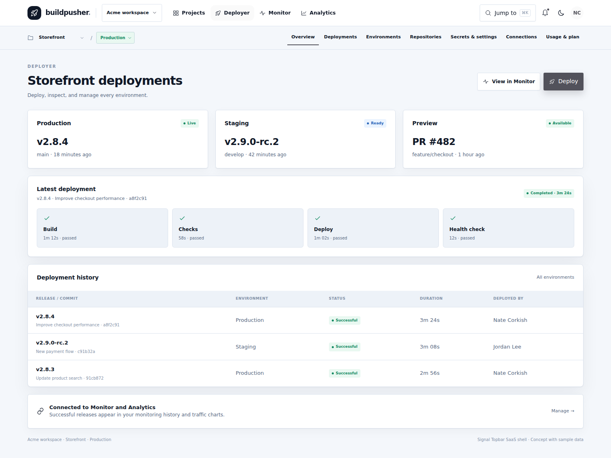
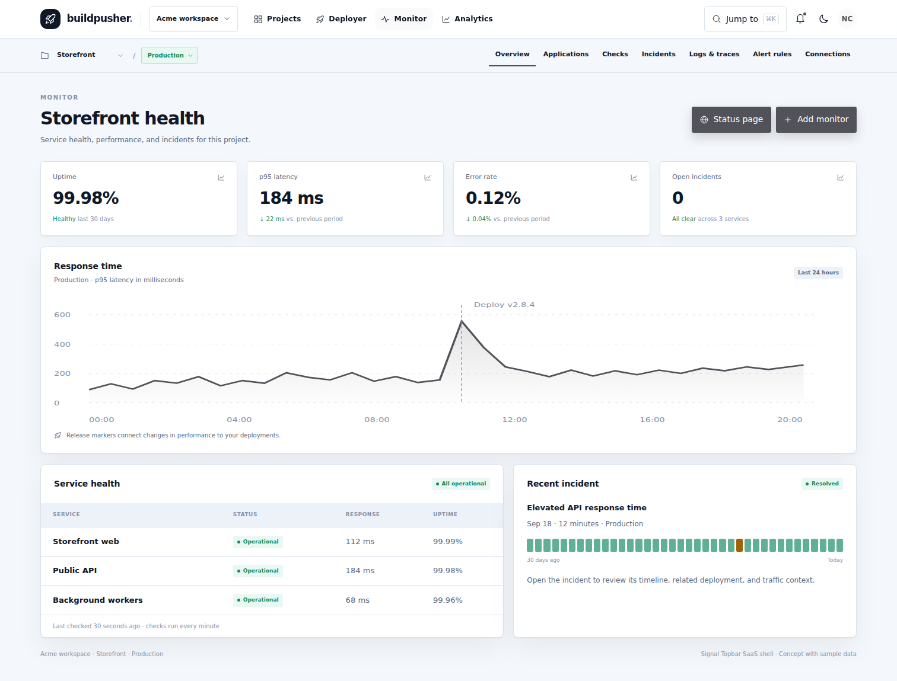
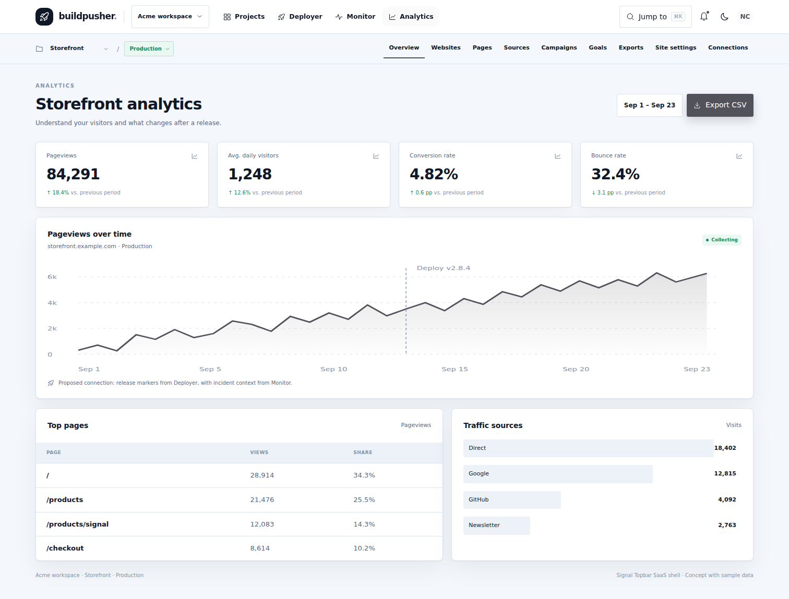

# Unified app UI preview

These screens use the Signal Topbar SaaS shell, with a shared workspace and product bar, project/environment context, and product-local navigation. They show how the Projects dashboard can connect Deployer, Monitor, and Analytics while keeping each product's health and subscription visible.

The screenshots use sample data and are visual review artifacts, not live application screens. The target repo is implementing the shared shell and module foundations; Monitor and Analytics are not connected yet.

## Projects dashboard

## Deployer

## Monitor

## Analytics

